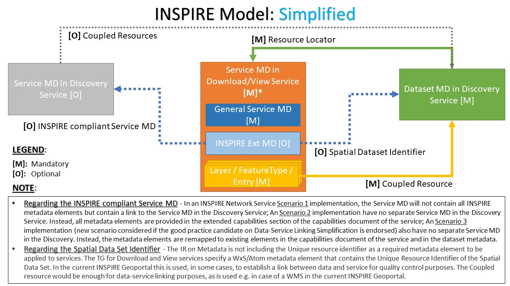
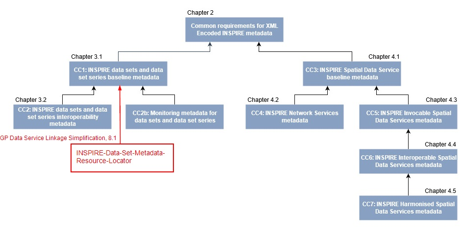

# Data Service Linking Simplification: Good Practice guidelines

`Version: Final 1.0`
`Date: 2022-11-19`

## Table of Contents

* [1. Introduction](#introduction)
* [2. Scope](#scope)
* [3. Conformance](#conformance)
* [4. Normative references](#normative-references)
* [5. Terms and definitions](#terms-and-definitions)
* [6. Acronyms](#acronyms)
* [7. Data Service Linking Simplification](#ds-linking-simplif)
    * [7.1. Main principles](#main-principles)
    * [7.2. Resources](#resources)
* [8. Part A. Data-Service Linking Simplification. Requirements classes](#part-a-rcs)
    * [8.1. INSPIRE Data Set Metadata Resource Locator](#rcs-ds-md-resloc)
        * [8.1.1. INSPIRE Data set Metadata Resource Locator - Requirements class](#rc-ds-md-resloc)
    * [8.2. INSPIRE Network Service Metadata Coupled Resource](#rcs-ns-md-coupledres)
        * [8.2.1. INSPIRE Network Service Metadata Coupled Resource - Service Metadata](#rc-ns-md-coupledres-svr-md)
        * [8.2.2. INSPIRE Network Service Metadata Coupled Resource - View Service (WMS)](#rc-ns-md-coupledres-view-wms)
        * [8.2.3. INSPIRE Network Service Metadata Coupled Resource - Download Service (WFS) - Requirements class](#rc-ns-md-coupledres-dwnl-wfs)
        * [8.2.4. INSPIRE Network Service Metadata Coupled Resource - Download Service (Atom)](#rc-ns-md-coupledres-dwnl-atom)
* [9. Part B. Use of INSPIRE conformant standard capabilities documents](#part-b)
    * [9.1. Mapping of INSPIRE elements in ExtendedCapabilities](#part-b-mapping-extended-capabilities)
        * [9.1.1. Resource type](#part-b-resource-type)
        * [9.1.2. Resource locator](#part-b-resource-locator)
        * [9.1.3. Spatial data service type](#part-b-spatial-data-service-type)
        * [9.1.4. Temporal reference](#part-b-temporal-reference)
        * [9.1.5. Conformity](#part-b-conformity)
        * [9.1.6. Metadata point of contact](#part-b-metadata-point-of-contact)
        * [9.1.7. Metadata date](#part-b-metadata-date)
        * [9.1.8. Supported languages](#part-b-supported-languages)
    * [9.2. Mapping of INSPIRE metadata elements per service type (protocol)](#part-b-mapping-per-service)
        * [9.2.1. WMS 1.3](#part-b-mapping-per-service-wms)
        * [9.2.2. WFS 2.0](#part-b-mapping-per-service-wfs)
        * [9.2.3. Atom](#part-b-mapping-per-service-atom)
* [10. Future developments](#future-dev)
* [Annex A: Examples](#annex-a)


## 1. Introduction <a name="introduction"></a>

This good practice candidate is based on the collection and comparison of proposals received from the members of the temporary MIWP technical sub-group 2.3.2 on data and service linking simplification. This document leverages on the recommendations, initially described in the [Discussion Paper on possible simplification of data-service linking in INSPIRE](https://github.com/INSPIRE-MIF/gp-data-service-linking-simplification/blob/main/resources/Discussion%20Paper%20on%20data-service%20linking%20v0.5.docx), and further improved by the subsequent [proposals for the simplification approach](https://github.com/INSPIRE-MIF/gp-data-service-linking-simplification/tree/main/proposals) made by the members of the technical sub-group.

The reference for the metadata specification used in this proposal is the [INSPIRE MD TG]. The reference for the INSPIRE Network Service (Download and View) specifications are the [INSPIRE NS - Download Service TG] and [INSPIRE NS - View Service TG], respectively.

## 2. Scope <a name="scope"></a>

This document provides a set of opinionated interpretations and rules, that de facto standard web applications can currently support, based on the current list of Requirements and Recommendations expressed in the INSPIRE Technical Guidance (TG) documents.

## 3. Conformance <a name="conformance"></a>

The requirements classes expressed here apply to the data set and service metadata records, as well as to the service (capabilities) documents.
In particular, the data set and service metadata records shall be INSPIRE-compliant (verifiable through tests performed in the Reference Validator), should be available in the relevant national geoportal catalog (see https://inspire.ec.europa.eu/INSPIRE-in-your-Country), and consequently harvested by the [INSPIRE Geoportal](https://inspire-geoportal.ec.europa.eu).

Furthermore, at the time of writing, the requirements expressed here for the Download Services are not applicable for specifications based on OGC APIs due to the lack of an agreed mapping for some conditional and mandatory INSPIRE metadata elements (in particular the Coupled Resource, and Unique Resource Identifier) in the [OAPIF GP] document.

## 4. Normative references <a name="normative-references"></a>

- **[ISO 19115:2005]** - EN ISO 19115:2005, *Geographic information — Metadata*
- **[ISO 19119:2016]** - EN ISO 19119:2016, *Geographic information — Services*
- **[ISO/TS 19139:2007]** - ISO/TS 19139:2007, *Geographic information — Metadata — XML schema implementation*
- **[ISO 19128:2005]** - EN ISO 19128:2005, *Geographic information — Web map server interface*
- **[ISO 19142:2010]** - EN ISO 19142:2010, *Geographic information — Web Feature Service*
- **[IRs for NS]** - Commission Regulation (EC) No 976/2009 of 19 October 2009 implementing Directive 2007/2/EC of the European Parliament and of the Council as regards the Network Services
- **[IRs for ISDSS]** - Commission Regulation (EU) No 1089/2010 of 23 November 2010 implementing Directive 2007/2/EC of the European Parliament and of the Council as regards interoperability of spatial data sets and services
- **[INSPIRE MD TG]** - JRC. *Technical Guidance for the implementation of INSPIRE dataset and service metadata based on ISO/TS 19139:2007*.  v2.0.1 - 2017-03-02
- **[INSPIRE NS - Download Service TG]** - JRC. *Technical Guidance for the implementation of INSPIRE Download Services*. v3.1 - 2013-08-09
- **[INSPIRE NS - View Service TG]** - JRC. *Technical Guidance for the implementation of INSPIRE View Services*. v3.11 - 2013-04-04
- **[RFC 4287]** - Internet Engineering Task Force (IETF). RFC 4287, *The Atom Syndication Format*. Initial release: December 2005

<!-- Second parts of the reference-style links, see also https://www.markdownguide.org/basic-syntax/#reference-style-links  -->
[ISO 19115:2005]: https://www.isotc211.org/2005/gmd "ISO 19115:2005, Geographic information — Metadata"
[ISO 19119:2016]: https://www.iso.org/standard/59221.html?browse=tc "ISO 19119:2016, Geographic information — Services"
[ISO/TS 19139:2007]: https://www.isotc211.org/2005/gmd/ "ISO/TS 19139:2007, Geographic information — Metadata — XML schema implementation"
[ISO 19128:2005]: https://www.iso.org/standard/32546.html?browse=tc "Geographic information — Web map server interface"
[ISO 19142:2010]: https://www.iso.org/standard/42136.html?browse=tc "EN ISO 19142:2010, Geographic information — Web Feature Service"
[IRs for NS]: https://eur-lex.europa.eu/legal-content/EN/TXT/HTML/?uri=CELEX:02009R0976-20141231&from=EN "Implementing Rules for Network Services (consolidated version of 31/12/2014)"
[IRs for ISDSS]: https://eur-lex.europa.eu/legal-content/EN/TXT/HTML/?uri=CELEX:02010R1089-20141231&from=EN "Implementing Rules for interoperability of spatial data sets and services (consolidated version of 31/12/2014)"
[INSPIRE MD TG]: https://inspire.ec.europa.eu/id/document/tg/metadata-iso19139 "Technical Guidance for the implementation of INSPIRE dataset and service metadata based on ISO/TS 19139:2007"
[INSPIRE NS - Download Service TG]: https://inspire.ec.europa.eu/documents/technical-guidance-implementation-inspire-download-services "Technical Guidance for the implementation of INSPIRE Download Services"
[INSPIRE NS - View Service TG]: https://inspire.ec.europa.eu/documents/technical-guidance-implementation-inspire-view-services-1 "Technical Guidance for the implementation of INSPIRE View Services"
[RFC 4287]: https://www.rfc-editor.org/rfc/rfc4287 "The Atom Syndication Format"

## 5. Terms and definitions <a name="terms-and-definitions"></a>

For the purposes of this document, the following terms and definitions apply:

| Term | Definition | Source |
| --- | --- | --- |
| content negotiation | The practice of providing multiple representations available via the same URI | [ISO/IEC 19788](https://www.iso.org/obp/ui/#iso:std:iso-iec:19788:-7:ed-1:v1:en:sec:3.20) |
| data set | Identifiable collection of data. | [ISO 19115](https://www.iso.org/obp/ui/#iso:std:iso:19115:-2:ed-2:v1:en:sec:3.6) |
| direct access download service | Download Service which provides access to the Spatial Objects in Spatial Data Sets based upon a query | [IRs for NS] |
| encoding | Conversion of data into a series of codes. | [ISO 19118](https://www.iso.org/obp/ui/#iso:std:iso:19118:ed-2:v1:en:term:4.13) |
| encoding rule | Identifiable collection of conversion rules that define the encoding for a particular data structure. | [ISO 19118](https://www.iso.org/obp/ui/#iso:std:iso:19118:ed-2:v1:en:term:4.14) |

**NOTE** ISO and the European Commission maintain comprehensive terminological databases at the following addresses:
- [ISO Online browsing platform](https://www.iso.org/obp)
- [INSPIRE glossary](http://inspire.ec.europa.eu/glossary)

## 6. Acronyms <a name="acronyms"></a>

| Abbreviation | Term |
| --- | --- |
| API | Application Programming Interface |
| GML | Geography Markup Language |
| URL | Uniform Resource Locator |
| WFS | Web Feature Service |
| WMS | Web Map Service |
| WMTS | Web Map Tile Service |

## 7. Data Service Linking Simplification <a name="ds-linking-simplif"></a>

### 7.1. Main principles <a name="main-principles"></a>

- An INSPIRE data set shall have INSPIRE View and Download services.
- The linkage between the data set and the View and Download services shall be ensured by the bidirectional relationship between the data set metadata and the service metadata.

### 7.2. Resources <a name="resources"></a>




## 8. Part A. Data-Service Linking Simplification. Requirements classes <a name="part-a-rcs"></a>

### 8.1. INSPIRE Data Set Metadata Resource Locator” <a name="rcs-ds-md-resloc"></a>

### 8.1.1. INSPIRE Data set Metadata Resource Locator - Requirements class <a name="rc-ds-md-resloc"></a>

| Requirements class | http://inspire.ec.europa.eu/id/spec/ds-linking-simplification/1.0/ds-md-resource-locator |
| --- | --- |
| Target type | ISO/TS 19139:2007 Geographic information Metadata XML schema implementation (Data sets and Data set series metadata) |
| Dependency | https://inspire.ec.europa.eu/id/ats/metadata/2.0/datasets-and-series (See NOTE below) |

\* NOTE: This is the URI of the Conformance class. Refer to [INSPIRE MD TG] [Chapter 3.1](https://github.com/INSPIRE-MIF/technical-guidelines/blob/2022.2/metadata/metadata-iso19139/metadata-iso19139.adoc#31-baseline-metadata-for-data-sets-and-data-set-series) to look up for information about the requirements class itself.

The following graphic illustrates the dependency of the “INSPIRE-Data-Set-Metadata-Resource-Locator” requirements class from Conformance Class 1 “INSPIRE data sets and data set series baseline metadata” defined in Chapter 3.1 of the [INSPIRE MD TG], which establishes the requirements for metadata records describing an INSPIRE data set or data set series encoded in ISO 19139 based XML format.



The Resource Locator element of a data set metadata record shall point to the URL where the service can be contacted. 

Setting up the correct resource locators is important for the connection between the data sets and the services that provide access to them, or for providing additional information concerning the data sets.

In particular, **TG Requirement 1.8** of [INSPIRE MD TG] expresses the obligation to provide online access, if available, to the described data set or data set series.

Furthermore, the INSPIRE legal framework requires that data sets are made available through View and Download services, which in turn implies that at least two locators need to be expressed in the data set metadata: one for a View Service and one for a Download Service.

The “/req/view-linkage” and “/req/download-linkage” requirements below are an enforcement of **TG Recommendation 1.9** in [INSPIRE MD TG] for the data set metadata record.

The class described in this section requires that the Resource Locator element shall point to the set of additional information about a service resource (i.e. "Get Download/View Service Metadata" operation). 

Additionally, The class described in this section requires the presence of `<gmd:protocol>` and `<gmd:applicationProfile>`, paired with the defined codelist values from the INSPIRE Registry. This would imply fulfilling this portion of the simplification described here.

The presence of additional Resource Locator elements, pointing to the data set itself (e.g. "Get Spatial Data Set" request of a Download Service), is allowed, due to the multiplicity expressed by **TG Requirement 1.8**. Consequently, these additional Resource Locator elements should avoid at least the use of the `<gmd:applicationProfile>` element specified below, in order to reduce the complexity of a machine-to-machine element recognition made by an INSPIRE software implementation such as the INSPIRE Geoportal.

#### Recommendation: \<gmd:protocol\> element

- For this element, the INSPIRE Registry offers a set of external codelist values from the [ProtocolValue codelist](https://inspire.ec.europa.eu/metadata-codelist/ProtocolValue).
- Regarding the label of a codelist, the INSPIRE Registry specifies the text to be used, which should follow the metadata language.
- The [INSPIRE MD TG] already recommends the use of the `gmx:Anchor` element, instead of `gco:CharacterString`, when the provided text is a term or code.
- The use of the element `gco:CharacterString` is allowed for backward compatibility with an existing Resource Locator description that might be already compliant with this simplification approach.

| **Recommendation** | **/rec/resource-locator-protocol** |
| --- | --- |
| A | The `protocol` element SHOULD be encoded as `gmx:Anchor`. The attribute `xlink:href` should point to a valid unique resource identifier of the ProtocolValue codelist. The text value should match the related codelist label, expressed in the metadata language where available. |

##### Example of a View Service locator with `<gmx:Anchor>` encoding
```xml
<gmd:protocol>
    <gmx:Anchor xlink:href="http://www.opengis.net/def/serviceType/ogc/wms">OGC Web Map Service</gmx:Anchor>
</gmd:protocol>
```

##### Example of a View Service locator with `<gco:CharacterString>` encoding
```xml
<gmd:protocol>
    <gco:CharacterString>OGC Web Map Service</gco:CharacterString>
</gmd:protocol>
```

_NOTE_: At the time of writing, the above examples use `eng` as metadata language, and they express the codelist `http://www.opengis.net/def/serviceType/ogc/wms` with the label "OGC Web Map Service". Please, check and use always the codelist label currently in force within the INSPIRE Registry.

#### Recommendation: \<gmd:applicationProfile\> element

- For this element, the INSPIRE Registry provides the values from the [SpatialDataServiceType codelist](https://inspire.ec.europa.eu/metadata-codelist/SpatialDataServiceType).
- Regarding the label of a codelist, the INSPIRE Registry specifies the text to be used, which should follow the metadata language.
- The [INSPIRE MD TG] already recommends the use of the `gmx:Anchor` element, instead of `gco:CharacterString`, when the provided text is a term or code.
- The existence of the element `gco:CharacterString` is allowed for backward compatibility with an existing Resource Locator description that might be already compliant **with this simplification **.


| **Recommendation** | **/rec/resource-locator-application-profile** |
| --- | --- |
| A | The element `applicationProfile` SHOULD be encoded with `gmx:Anchor`. The attribute `xlink:href` should point to a valid unique resource identifier of the mentioned codelist. The text value should match the related codelist label, expressed in the metadata language where available. |

##### Example of a Download Service locator with `<gmx:Anchor>` encoding
```xml
<gmd:applicationProfile>
    <gmx:Anchor xlink:href="https://inspire.ec.europa.eu/metadata-codelist/SpatialDataServiceType/download">Downloaddienst</gmx:Anchor>
</gmd:applicationProfile>
```

##### Example of a Download Service locator with а `<gco:CharacterString>` encoding
```xml
<gmd:applicationProfile>
    <gco:CharacterString>Downloaddienst</gco:CharacterString>
</gmd:applicationProfile>
```

_NOTE_: At the time of writing, the above examples use `dut` as metadata language, and they express the codelist `https://inspire.ec.europa.eu/metadata-codelist/SpatialDataServiceType/download` with the label "Downloaddienst". Please, check and use always the codelist label currently in force within the INSPIRE Registry.

#### Requirement: INSPIRE View Service linking

- Within the element `gmd:URL` linking to a view service, the URL shall point to the response of a "Get View Service Metadata" request of the service providing access to this data set (e.g. the "GetCapabilities" document in the case of an OGC:WMS service).

| Requirement | /req/view-linkage |
|---|---|
| A | A Resource Locator to an INSPIRE View Service providing view access to the described data set or data set series SHALL be given. It SHALL be encoded using the `/gmd:MD_Metadata/gmd:distributionInfo/gmd:MD_Distribution/gmd:transferOptions/gmd:MD_DigitalTransferOptions/gmd:onLine/gmd:CI_OnlineResource` element. |
| B | The element `gmd:URL` SHALL point to the response of the Get View Service Metadata request of the View Service |
| C | The element `gmd:protocol` SHALL be present. |
| D | If the element `gmd:protocol` is encoded using `gmx:Anchor`, the attribute `gmx:Anchor/@xlink:href` SHALL point to the URI of one of the values in https://inspire.ec.europa.eu/metadata-codelist/ProtocolValue. |
| E | If the element `gmd:protocol` is encoded using `gco:CharacterString`, the text value of `gco:CharacterString` SHALL match the label of one of the values in https://inspire.ec.europa.eu/metadata-codelist/ProtocolValue in the language of the metadata language. |
| F | The element `gmd:applicationProfile` SHALL be present. |
| G | If the element `gmd:applicationProfile` is encoded using `gmx:Anchor`, the attribute `gmx:Anchor/@xlink:href` SHALL point to https://inspire.ec.europa.eu/metadata-codelist/SpatialDataServiceType/view. |
| H | If the element `gmd:applicationProfile` is encoded using `gco:CharacterString`, the text value of `gco:CharacterString` SHALL match the label of https://inspire.ec.europa.eu/metadata-codelist/SpatialDataServiceType/view in the language of the metadata language. |

See [Annex A: Examples](#annex-a) for an example of this linkage requirement.


#### Requirement: INSPIRE Download Service linkage

- Within the element `gmd:URL` linking to a download service, the URL shall point to the response of a "Get Download Service Metadata" request of the service providing access to this data set (e.g. the "GetCapabilities" document in the case of an OGC:WFS service).

| Requirement | /req/download-linkage |
|---|---|
| A | A Resource Locator to an INSPIRE Download Service providing download access to the described data set or data set series SHALL be given. It SHALL be encoded using the `/gmd:MD_Metadata/gmd:distributionInfo/gmd:MD_Distribution/gmd:transferOptions/gmd:MD_DigitalTransferOptions/gmd:onLine/gmd:CI_OnlineResource` element. |
| B | The element `gmd:URL` SHALL point to the response of the Get Download Service Metadata request of the Download Service |
| C | The element `gmd:protocol` SHALL be present. |
| D | If the element `gmd:protocol` is encoded using `gmx:Anchor`, the attribute `gmx:Anchor/@xlink:href` SHALL point to the URI of one of the values in https://inspire.ec.europa.eu/metadata-codelist/ProtocolValue. |
| E | If the element `gmd:protocol` is encoded using `gco:CharacterString`, the text value of `gco:CharacterString` SHALL match the label of one of the values in https://inspire.ec.europa.eu/metadata-codelist/ProtocolValue in the language of the metadata language. |
| F | The element `gmd:applicationProfile` SHALL be present. |
| G | If the element `gmd:applicationProfile` is encoded using `gmx:Anchor`, the attribute `gmx:Anchor/@xlink:href` SHALL point to https://inspire.ec.europa.eu/metadata-codelist/SpatialDataServiceType/download. |
| H | If the element `gmd:applicationProfile` is encoded using `gco:CharacterString`, the text value of `gco:CharacterString` SHALL match the label of https://inspire.ec.europa.eu/metadata-codelist/SpatialDataServiceType/download in the language of the metadata language. |

See [Annex A: Examples](#annex-a) for an example of this linkage requirement.

### 8.2. INSPIRE Network Service Metadata Coupled Resource  <a name="rcs-ns-md-coupledres"></a>

The Coupled Resource metadata element refers to, where relevant, the target spatial data set(s) of the described service.  
It is implemented through a URL that points to the metadata record of the data set on which the service operates. Therefore, it helps to link services to the relevant data sets.

Regarding the definition of a Network Service metadata, two scenarios have been identified for publishing metadata conforming to the [IRs for NS], and on the [INSPIRE MD TG]. It is up to the Member State to choose which scenario best fits their specific needs. As these scenarios are not mutually exclusive, a Member State may also choose to implement both.

**NOTE** For the ATOM implementation, the [INSPIRE NS - Download Service TG] does not offer a similar multiple scenario configuration due to the lack of mapping elements in such an implementation.


#### 8.2.1. INSPIRE Network Service Metadata Coupled Resource - Service Metadata  <a name="rc-ns-md-coupledres-svr-md"></a>

#### INSPIRE Network service - Scenario 1

- In Scenario 1, the INSPIRE network service metadata is available in a Discovery Service catalog and is referenced through the `<inspire_common:MetadataURL>` element within the INSPIRE ExtendedCapabilities section of such service.
- The service metadata shall define a `<srv:operatesOn>` element for every defined data set published by the service.
- The data set metadata URL may point to a Discovery Service different from the national reference catalog. This may apply especially for federated Discovery Service catalogues.

In this scenario, the Coupled Resource metadata element is implemented by reference, i.e. through a URL that points to the metadata record of the data set on which the service operates.

For ISO/TS 19139:2007 Geographic information Metadata XML schema implementation Data set metadata this specification refers to [INSPIRE MD TG] [Chapter 4.1](https://github.com/INSPIRE-MIF/technical-guidelines/blob/2022.2/metadata/metadata-iso19139/metadata-iso19139.adoc#41-baseline-metadata-for-spatial-data-services).

#### Recommendation: \<srv:operatesOn\> element

According **TG Requirement 3.6** of [INSPIRE MD TG], the links pointing to the online metadata descriptions of data sets provided by the described service shall be given using `<srv:operatesOn>` element. The multiplicity of this element is 0..n.

Futhermore, this property shall be implemented by reference. The `xlink:href` attribute of each of the `<srv:operatesOn>` elements shall contain a URI pointing to the `<gmd:MD_DataIdentification>` element of the metadata record of the provided the data set or data set series.

This specification proposes to relax the implementation of the Coupled Resource by making the linkage to the `<gmd:MD_DataIdentification>` element of the data set metadata an optional feature, just pointing to the URL of the metadata, with or without the additional `#MD_DataIdentification` pointer).

##### Rationale
Although [ISO 19119:2016] requires that the target of the `<srv:operatesOn>` element (Coupled Resource) is the `#MD_DataIdentification` class of the linked dataset metadata, due to the different existing metadata implementations, this specification proposes to allow a more simple implementation of the Coupled Resource linkage, as stated above. 

##### Changes to the current INSPIRE framework

In [Section 4.1.2.4](https://github.com/INSPIRE-MIF/technical-guidelines/blob/2022.1/metadata/metadata-iso19139/metadata-iso19139.adoc#4124-linking-to-provided-data-sets-using-coupled-resource) of the [INSPIRE MD TG]:

**1**. Replace TG Requirement 3.6:

> TG Requirement 3.6: metadata/2.0/req/sds/coupled-resource
> 
> Links pointing to the online metadata descriptions of data sets provided by the described service shall be given using _srv:operatesOn_ element.
> 
> The multiplicity of this element is 0..n.
> 
> This property shall be implemented by reference. The `xlink:href` attribute of each of the `<srv:operatesOn>` elements shall contain a URI pointing to the _gmd:MD_DataIdentification_ element of the metadata record of the provided the data set or data set series.

with this content:

> TG Requirement 3.6: metadata/2.0/req/sds/coupled-resource
> 
> Links pointing to the online metadata descriptions of data sets provided by the described service shall be given using `<srv:operatesOn>` element.
> 
> The multiplicity of this element is 0..n.
> 
> This property shall be implemented by reference. The `xlink:href` attribute of each of the `<srv:operatesOn>` elements shall contain a URI pointing to the metadata record of the provided data set or data set series.

**2**. Add the following TG Recommendation, and subsequent Explanatory note and Example, just after the amended TG Requirement 3.6:

TG Recommendation:

> TG Recommendation _X.Y_:
> In order to be fully compliant with [ISO 19119:2016], the URI contained in the `xlink:href` attribute of each of the `<srv:operatesOn>` elements should specifically point to the `<gmd:MD_DataIdentification>` element of the metadata record of the provided data set or data set series.

Explanatory note:

> NOTE: The different practices in the implementation of the Coupled Resource element in existing metadata is acknowledged. Despite [ISO 19119:2016] requires that the target of the `<srv:operatesOn>` elements (Coupled Resource) is the `#MD_DataIdentification` class of the linked dataset metadata, this technical guidelines allows a more simple approach for the service-data set linking by allowing, in the `xlink:href` attribute of each of the `<srv:operatesOn>` elements, the use of URI values with or without the `#MD_DataIdentification` pointer.

Example:

> `/gmd:MD_Metadata/gmd:identificationInfo/srv:SV_ServiceIdentification/srv:operatesOn`:
> 
> `<srv:operateson xlink:href="http://example.com/csw?SERVICE=CSW&amp;VERSION=2.0.2&amp;REQUEST=GetRecordById&amp;ID=f9ee6623-cf4c-11e1-9105-0017085a97ab&amp;OUTPUTSCHEMA=http://www.isotc211.org/2005/gmd&amp;ELEMENTSETNAME=full">
> </srv:operateson>`
> 
> Example _X.Y_: Pattern for the Coupled resource link given using the `<srv:operatesOn>` element with URL pointing to the metadata record of the provided data set or data set series, without any fragment identifier specifically pointing to the `<gmd:MD_DataIdentification>` element.
> 
> `<srv:operateson xlink:href="https://geometadaten.lfrz.at/at.lfrz.discoveryservices/srv/ger/csw?SERVICE=CSW&amp;VERSION=2.0.2&amp;REQUEST=GetRecordById&amp;ID=9db8a0c3-e92a-4df4-9d55-8210e326a7ed&amp;OUTPUTSCHEMA=http://www.isotc211.org/2005/gmd&amp;ELEMENTSETNAME=full">
> </srv:operateson>`
> 
> Example _X.Y_: Working example from the Austrian national SDI based on the previous pattern - Linked URL: https://geometadaten.lfrz.at/at.lfrz.discoveryservices/srv/ger/csw?SERVICE=CSW&VERSION=2.0.2&REQUEST=GetRecordById&ID=9db8a0c3-e92a-4df4-9d55-8210e326a7ed&OUTPUTSCHEMA=http://www.isotc211.org/2005/gmd&ELEMENTSETNAME=full. 

#### Recommendation: \<srv:operatesOn\> element priority over \<wms:MetadataURL\> and \<wfs:MetadataURL\> elements

| **Recommendation** | **/rec/coupled-resource-operateson-match-metadataurl** |
| --- | --- |
| A | Within the Scenario 1 implementation, the references described with these optional `metadataURL` elements should match each of the `srv:operatesOn` elements contained in the service metadata record. In case of discrepancies, the references expressed with `srv:operatesOn` prevail over the other associations. |


#### 8.2.2. INSPIRE Network Service Metadata Coupled Resource - View Service (WMS)  <a name="rc-ns-md-coupledres-view-wms"></a>

#### INSPIRE Network service - Scenario 2

- In Scenario 2, the [INSPIRE NS - View Service TG] maps all INSPIRE metadata elements to the applicable elements in the service, e.g. OGC WMS Capabilities in this case. For OGC WMS services, it currently relies on the ExtendedCapabilities section for the remaining elements. [Annex B](#annex-b), which is subject to future work proposes an approach for the revision of the mapping of the INSPIRE requirements with the aim to possibly remove the Extended Capabilities section.
- The data set metadata URL may point to a Discovery Service different from the national reference catalog. This may apply especially for federated Discovery Service catalogues.

For [ISO 19128:2005] Web map server interface services (OGC WMS View services) this specification refers to [INSPIRE NS - View Service TG] Chapter 4 "INSPIRE Profile of ISO 19128".

#### Requirements: \<wms:MetadataURL\> element

According **TG Requirement 13** of [INSPIRE NS - View Service TG], the Coupled Resource metadata element shall be mapped to the `<wms:MetadataURL>` elements of the Layer elements of the service capabilities. If linkage to the data sets or series on which the service operates are available, then the linkage to these resources shall be provided as stated by the [INSPIRE MD TG].

Aditionally, according **TG Requirement 14** of [INSPIRE NS - View Service TG], each of the `<wms:MetadataURL>` elements shall be populated with a URL that allows access to an unambiguous metadata record. The URL shall be either an HTTP/GET call on the `GetRecordById` operation of the Discovery Service or a direct link to the ISO 19139 data set or data set series metadata document.


#### 8.2.3. INSPIRE Network Service Metadata Coupled Resource - Download Service (WFS) - Requirements class  <a name="rc-ns-md-coupledres-dwnl-wfs"></a>

#### INSPIRE Network service - Scenario 2

 - In Scenario 2, the [INSPIRE NS - Download Service TG] maps all INSPIRE metadata elements to the applicable elements in the service, e.g. WFS OGC Capabilities in this case. For OGC WFS services, it currently relies on the ExtendedCapabilities section for the remaining elements. [Annex B](#annex-b), which is subject to future work proposes an approach for the revision of the mapping of the INSPIRE requirements with the aim to possibly remove the Extended Capabilities section.
- The data set metadata URL may point to a Discovery Service different from the national reference catalog. This may apply especially for federated Discovery Service catalogues.

#### Requirements class

This requirements class applies when INSPIRE Network service - Scenario 2 is used for Web Feature Services.

| Requirements class | http://inspire.ec.europa.eu/id/spec/ds-linking-simplification/1.0/ns-md-coupled-resource-dwnl-wfs |
| --- | --- |
| Target type | [ISO 19142:2010] - Geographic information — Web Feature Service (OGC WFS Download service) |
| Dependency | https://inspire.ec.europa.eu/id/ats/download-wfs (see NOTE below) |

\* NOTE: This is the URI of the Conformance class. Refer to [INSPIRE NS - Download Service TG] Chapter 6 "Web Feature Service and Filter Encoding Implementation of Pre-defined Dataset Download Service" to look up for information about the requirements class itself.

#### Requirement: \<wfs:MetadataURL\> element

Section 6.6 of [INSPIRE NS - Download Service TG] defines two options to make the Download Service INSPIRE metadata elements available in a standard Web Feature Service (WFS).

The first option is to use the `ows:ExtendedCapabilities` to publish a link to a Download Service metadata record. (e.g. in a discovery service). This should be done using a `<inspire_common:MetadataURL>` in the extended capabilities section of the INSPIRE WFS service. 
The second option is to publish all the metadata elements directly in the `<WFS_Capabilities>` (and `ows:ExtendedCapabilities`) using a predefined mapping specified in this section.

The mapping described for the second option, sets the mapping of the Coupled Resource metadata element to the `wfs:MetadataURL` element of an ISO 19142 `<WFS_Capabilities>` Web Feature Service.

This specification reinforces the use of this second option with the requirements class defined below.

| **Requirement** | **/req/coupled-resource-metadataurl-locator** |
| --- | --- |
| A | The URL expressed within the `wfs:MetadataURL` element SHALL point to the metadata record of the provided data set or data set series, available in a Discovery Service catalog. |


#### 8.2.4. INSPIRE Network Service Metadata Coupled Resource - Download Service (Atom)  <a name="rc-ns-md-coupledres-dwnl-atom"></a>

#### INSPIRE Network service - Scenario 2

 - In Scenario 2, the [INSPIRE NS - Download Service TG] maps all INSPIRE metadata elements to the applicable elements in the service, e.g. ATOM feed elements in this case. [Annex B](#annex-b), which is subject to future work proposes an approach for the revision of the mapping of the INSPIRE requirements with the aim to possibly remove the Extended Capabilities section.
- The data set metadata URL may point to a Discovery Service different from the national reference catalog. This may apply especially for federated Discovery Service catalogues.

For Atom Syndication Format services (Atom download services - see [RFC 4287]) this specification refers to [INSPIRE NS - Download Service TG] Chapter 5 "Atom Implementation of Pre-defined Dataset Download Service".

#### Requirement: Download Service Feed \<entry\> element

According **TG Requirement 14** of [INSPIRE NS - Download Service TG], each feed `<entry>` in a 'Download Service Feed' shall contain a link to a data set metadata record. This link shall have a `rel` attribute with a value of `describedby` and a `type` attribute with a value `application/xml`.


## 9. Part B. Use of INSPIRE conformant standard capabilities documents <a name="part-b"></a>

This section provides the details on the agreed version of the new mapping of INSPIRE service metadata elements to the available elements in the GetCapabilities document of the OGC base standard services (WMS, WFS) and Atom feed in order to remove the need for the Extended Capabilities section and thus achieve a more complete implementation simplification.

Currently, the INSPIRE metadata elements that cannot be mapped to available elements in the GetCapabilities document of the OGC base standard services are implemented as Extended Capabilities. In case of Atom, only some of the mandatory INSPIRE Metadata elements for the Download service have been mapped to the Atom feed files. The current mapping between INSPIRE metadata elements and ISO 19128 WMS elements is provided in the Table 3 in [INSPIRE NS - View Service TG](https://inspire.ec.europa.eu/documents/technical-guidance-implementation-inspire-view-services-1), whereas the mapping of INSPIRE Metadata elements to Atom and to ISO 19142 WFS is provided in the Table 17 (page 38) and Table 19 (page 66) in [INSPIRE NS - Download Service TG](https://inspire.ec.europa.eu/documents/technical-guidance-implementation-inspire-download-services), respectively.

As outlined in the [Discussion Paper on possible simplification of data-service linking in INSPIRE](https://github.com/INSPIRE-MIF/gp-data-service-linking-simplification/blob/main/resources/Discussion%20Paper%20on%20data-service%20linking%20v0.5.docx), the aim of the proposed mapping in this section is to overcome the obstacles to the implementation of INSPIRE requirements for network services due to the required extensions to base standards. It provides a set of rules for the mapping of INSPIRE metadata elements with a new allocation in the GetCapabilities document in the OGC base standard services and the Atom feed.

### 9.1. Mapping of INSPIRE elements in ExtendedCapabilities <a name="part-b-mapping-extended-capabilities"></a>

The Table below provides a summary of the new mapping of INSPIRE metadata elements, previously mapped with elements in the Extended Capabilities section. 

| INSPIRE metadata elements | New allocation | Applicable on Service type |
| :- | :- | :- |
| Resource Type          | Not applicable | WMS - WFS - Atom |
| Resource Locator       | Not applicable| WMS - WFS - Atom |
| Spatial Data Service Type| `gmd:applicationProfile` element (in data set metadata record) | WMS - WFS - Atom |
| Temporal Reference     | `updateSequence` attribute in the `WMS_Capabilities`/`WFS_Capabilities` root element. Otherwise, `gmd:citation/gmd:CI_Citation/gmd:date/gmd:CI_Date/gmd:date` element in the data set metadata record, with one of the following prioritised  date types:- _publication_, - _revision_ or - _creation_ | WMS - WFS |
|                        | `feed/updated` element in the Atom feed. Otherwise, `gmd:citation/gmd:CI_Citation/gmd:date/gmd:CI_Date/gmd:date` element in the data set metadata record, with one of the following prioritised  date types: - _publication_, - _revision_ or - _creation_ | Atom |
| Conformity            | `wms:Keyword` element for each specification against the service is conformant, included within an specific `wms:KeywordList` group. | WMS |
|                       | `ows:Keyword` element for each specification against the service is conformant, included within an specific `ows:Keywords` group including the following `ows:Type` element: `<ows:Type codeSpace="http://data.europa.eu/eli">European Legislation Identifier (ELI)</ows:Type>` | WFS |
|                       |  `atom:category` element for each specification against which the service is conformant. | Atom |
| Metadata Point of Contact| `WMS_Capabilities/Service/ContactInformation/ContactPersonPrimary/ContactOrganization` and `WMS_Capabilities/Service/ContactInformation/ContactElectronicMailAddress` elements in GetCapabilities | WMS |
|                          | `WFS_Capabilities/ows:ServiceProvider/ows:ProviderName` and `WFS_Capabilities/ows:ServiceProvider/ows:ServiceContact/ows:ContactInfo/ows:Address/ows:ElectronicMailAddress` elements in GetCapabilities | WFS |
|                          | `<feed><author><name>` and `<feed><author><email>` elements | Atom |
| Metadata Date     | `updateSequence` parameter in the `WMS_Capabilities`/`WFS_Capabilities`root element. Otherwise, `gmd:citation/gmd:CI_Citation/gmd:date/gmd:CI_Date/gmd:date` element in the data set metadata record, with one of the following prioritised  date types:- _publication_, - _revision_ or - _creation_ | WMS - WFS |
|                        | `<updated>` element in the Atom feed. Otherwise, `gmd:citation/gmd:CI_Citation/gmd:date/gmd:CI_Date/gmd:date` element in the data set metadata record, with one of the following prioritised  date types: - _publication_, - _revision_ or - _creation_ | Atom|
| Metadata Language    | `gmd:MD_Metadata/gmd:language/gmd:LanguageCode` element in the data set metadata record for default language. `xml:lang` attribute for supported languages    | WMS - WFS - Atom |


Below, for each mapping element, the following information is provided: 
- the current mapping present in [INSPIRE NS - View Service TG](https://inspire.ec.europa.eu/documents/technical-guidance-implementation-inspire-view-services-1) and [INSPIRE NS - Download Service TG](https://inspire.ec.europa.eu/documents/technical-guidance-implementation-inspire-download-services);
- proposed mapping and rationale;
- detailed mapping description; and
- changes to the current INSPIRE framework.

#### 9.1.1. Resource type <a name="part-b-resource-type"></a>

Currently, the mapping of the resource type element to OWS service capabilities and Atom feed is as follows: 

| INSPIRE metadata elements | Elements of OWS service capabilities / Atom feed | Applicable on Service type |
| :- | :- | :- |
| Resource Type          | `inspire_common:ResourceType` (ExtendedCapabilities) | WMS - WFS |
| Resource Type          | not mapped | Atom |

##### Proposed mapping and rationale

As proposed in the [Discussion Paper on possible simplification of data-service linking in INSPIRE](https://github.com/INSPIRE-MIF/gp-data-service-linking-simplification/blob/main/resources/Discussion%20Paper%20on%20data-service%20linking%20v0.5.docx), if service metadata is available only through the given service, the resource type is implicit.

##### Detailed mapping description

No element is identified in the GetCapabilities document for the mapping with the resource type element.

##### Changes to the current INSPIRE framework

Integrate the TG Requirement 3.1 in [metadata TG](https://github.com/INSPIRE-MIF/technical-guidelines/blob/2022.1/metadata/metadata-iso19139/metadata-iso19139.adoc) with the following statement:

_In case of view and download services, when the service metadata is provided as response to a Get Download/View Service Metadata request, then the resource type is implicit and shall not be documented_.

Integrate the Implementation Requirement 11 in [View Services TG] with the following statement:

_In case the service metadata is provided as response to a Get Download/View Service Metadata request, then the resource type is implicit and shall not be documented_.

#### 9.1.2. Resource locator <a name="part-b-resource-locator"></a>

Currently, the mapping of the resource locator element to OWS service capabilities and Atom feed is as follows: 

| INSPIRE metadata elements | Elements of OWS service capabilities / Atom feed | Applicable on Service type |
| :- | :- | :- |
| Resource Locator          | `inspire_common:ResourceLocator` (ExtendedCapabilities) | WMS - WFS |
| Resource Locator          | Feed level link in the top Atom feed `/feed/link[@rel="self"]` | Atom |

##### Proposed mapping and rationale

As proposed in the [Discussion Paper on possible simplification of data-service linking in INSPIRE](https://github.com/INSPIRE-MIF/gp-data-service-linking-simplification/blob/main/resources/Discussion%20Paper%20on%20data-service%20linking%20v0.5.docx), if service metadata is available only through the given service, the resource locator is implicit; furthermore, more detailed information is available in the operations metadata of the service.

##### Detailed mapping description

No element is identified in the GetCapabilities document for the mapping with the resource locator element.

##### Changes to the current INSPIRE framework

_No change required._ 

#### 9.1.3. Spatial data service type <a name="part-b-spatial-data-service-type"></a>

Currently, the mapping of the spatial data service type element to OWS service capabilities and Atom feed is as follows:

| INSPIRE metadata elements | Elements of OWS service capabilities / Atom feed | Applicable on Service type |
| :- | :- | :- |
| Spatial Data Service Type          | `inspire_common:SpatialDataServiceType` (ExtendedCapabilities) | WMS - WFS |
| Spatial Data Service Type          | not mapped | Atom |


##### Proposed mapping and rationale

The spatial data service type will be provided by the `gmd:applicationProfile` element given in the data set metadata record and related to the resource locator pointing to the response of a "Get View/Download Service Metadata" request of the service providing access to that data set.

##### Detailed mapping description

Requirements to meet, recommendations and examples for the implementation of the mapping are already defined in the [Good Practice guidelines](https://github.com/INSPIRE-MIF/gp-data-service-linking-simplification/blob/main/proposals/JRC/ds-linking-simplification-good-practice.md#requirement-gmdapplicationprofile-element).

For WMS, the value to be used for the encoding of the `gmd:applicationProfile` element is "view" (URI: http://inspire.ec.europa.eu/metadata-codelist/SpatialDataServiceType/view).

For WFS and ATOM, the value to be used for the encoding of the `gmd:applicationProfile` element is "download" (URI: http://inspire.ec.europa.eu/metadata-codelist/SpatialDataServiceType/download).

##### Changes to the current INSPIRE framework

_No changes required._ (Changes already taken into account in Section 8 - Part A)

#### 9.1.4. Temporal reference <a name="part-b-temporal-reference"></a>

Currently, the mapping of the temporal reference element to OWS service capabilities and Atom feed is as follows:

| INSPIRE metadata elements | Elements of OWS service capabilities / Atom feed | Applicable on Service type |
| :- | :- | :- |
| Temporal Reference          | `inspire_common:TemporalReference` (ExtendedCapabilities) | WMS - WFS |
| Temporal Reference          | not mapped | Atom |

##### Proposed mapping and rationale

Temporal reference[^note_temporal_reference_19139] will be mapped to

- The optional `updateSequence` attribute in case of a WXS if in this attribute a timestamp value[^note_format_updatesequence] is present;
- The mandatory `<updated>` in case of an Atom[^note_format_updated].

This means that the last update of the service metadata is assumed equal to the update date of the service.

[^note_temporal_reference_19139]: In a ISO/TS 19139 metadata record, Temporal reference is mapped to `MD_Metadata.identificationInfo > MD_DataIdentification.citation > CI_Citation.date > CI_Date.date` element, see also [metadata TG](https://github.com/INSPIRE-MIF/technical-guidelines/blob/2022.1/metadata/metadata-iso19139/metadata-iso19139.adoc).

[^note_format_updatesequence]: The extended ISO 8601:2000 format, ccyy-mm-ddThh:mm:ss.sssZ whereby the precision may be reduced by omitting least-significant digits, e.g. 2022-01-26 or 2022-01-26T09:30Z, shall be used according to the [WMS specification](http://portal.opengeospatial.org/files/?artifact_id=14416). No reference to or description of the precise ISO 8601 format to be used, extended or basic, is present in the [OWS specification](https://portal.ogc.org/files/?artifact_id=20040).

[^note_format_updated]: The `updated` element shall be a timestamp including a time component, see also [The "atom:updated" Element](https://datatracker.ietf.org/doc/html/rfc4287#section-4.2.15) and [Date Constructs](https://datatracker.ietf.org/doc/html/rfc4287#section-3.3).

If in the optional `updateSequence` attribute a timestamp value is not present (WXS), the Metadata Date is mapped to the Temporal reference of the dataset metadata[^note_temporal_reference_19139]:

1. If a date of type `publication` is present, take this value as Temporal Reference; or
2. If a date of type `revision` is present, take this value as Temporal Reference;
3. Otherwise, take the date of type `creation` as value of the Temporal Reference.

For a WXS where the optional `updateSequence` is not present, this means that the last update of the service metadata is assumed to be the same as the publication, revision or creation date of the data set.

The same mapping is also used to derive the [Metadata date](#metadata-date) of the service.

The reasoning behind is that:
- The metadata in the capabilities is part of the service, so the update date of the metadata and the service are the same;
- The `updateSequence` attribute is optional in WXS, a fallback scenario is needed if this attribute is not present;
- In the case of deriving the Temporale Reference of the service from the dataset metadata, a strong connection between the administrator of the dataset metadata and the administrator of the service is needed.

##### Detailed mapping description

For **WMS 1.3**, the related [XML schema](http://schemas.opengis.net/wms/1.3.0/capabilities_1_3_0.xsd) snippet is:

```xml
<element name="WMS_Capabilities">
<annotation>
   <documentation>
        A WMS_Capabilities document is returned in response to a GetCapabilities request made on a WMS.
   </documentation>
</annotation>
<complexType>
   <sequence>
      <element ref="wms:Service"/>
      <element ref="wms:Capability"/>
   </sequence>
   <attribute name="version" type="string" fixed="1.3.0"/>
   <attribute name="updateSequence" type="string"/>
</complexType>
</element>
```

So it would look like this in a GetCapabilities response:

```xml
<WMS_Capabilities
  xmlns="http://www.opengis.net/wms"
  xmlns:xsi="http://www.w3.org/2001/XMLSchema-instance"
  version="1.3.0"
  updatesequence="2022-01-26"
  xsi:schemaLocation="http://www.opengis.net/wms http://schemas.opengis.net/wms/1.3.0/capabilities_1_3_0.xsd>
  <!-- ... -->
</WMS_Capabilities>
```

For **WFS 2.0**, using [OWS 1.1 schemas](http://www.opengis.net/ows/1.1), the related XML schema snippet is:

```xml
<complexType name="CapabilitiesBaseType">
   <annotation>
      <documentation>XML encoded GetCapabilities operation response.
      </documentation>
   </annotation>
   <sequence>
      <element ref="ows:ServiceIdentification" minOccurs="0"/>
      <element ref="ows:ServiceProvider" minOccurs="0"/>
      <element ref="ows:OperationsMetadata" minOccurs="0"/>
   </sequence>
   <attribute name="version" type="ows:VersionType" use="required"/>
   <attribute name="updateSequence" type="ows:UpdateSequenceType"
use="optional">
      <annotation>
         <documentation>Service metadata document version, having
values that are "increased" whenever any change is made in service
metadata document. Values are selected by each server, and are always
opaque to clients. When not supported by server, server shall not
return this attribute. </documentation>
         </annotation>
    </attribute>
</complexType>
```

So it would look like this in a GetCapabilities response:


```xml
<WFS_Capabilities xmlns="http://www.opengis.net/wfs/2.0" 
    xmlns:ows="http://www.opengis.net/ows/1.1" 
    xmlns:xsi="http://www.w3.org/2001/XMLSchema-instance" version="2.0.0" 
    xsi:schemaLocation="http://www.opengis.net/wfs/2.0 http://schemas.opengis.net/wfs/2.0/wfs.xsd"
    updateSequence="2022-01-26">
    <ows:ServiceIdentification>
    <!-- ... -->
    </ows:ServiceIdentification>
</WFS_Capabilities>
```

For an **ATOM feed**:

```xml
<?xml version="1.0" encoding="UTF-8"?>
<feed xmlns="http://www.w3.org/2005/Atom" xmlns:georss="http://www.georss.org/georss" xmlns:inspire_dls="http://inspire.ec.europa.eu/schemas/inspire_dls/1.0" xml:lang="nl">
<updated>2022-01-26T00:00:00Z</updated>
```

##### Changes to the current INSPIRE framework

Mapping of INSPIRE metadata elements per service type (protocol) <a name="mapping-per-service"></a>
####WMS 1.3
| INSPIRE Metadata element | WMS 1.3 without ExtendedCapabilities + ISO/TS 19139:2007 metadata record dataset | Note |
|---|---|---|
| Temporal Reference (M) | `updateSequence` attribute | If in the optional `updateSequence` attribute a timestamp value is not present, the Temporal Reference is mapped to the Temporal reference of the dataset metadata[^note_temporal_reference_19139], in order of a date of type `publication`,`revision` `creation`.|


#### WFS 2.0
| INSPIRE Metadata element | WFS 2.0 without ExtendedCapabilities + ISO/TS 19139:2007 metadata record dataset | Note |
|---|---|---|
| Temporal Reference (M) | `updateSequence` attribute | If in the optional `updateSequence` attribute a timestamp value is not present, the Temporal Reference is mapped to the Temporal reference of the dataset metadata[^note_temporal_reference_19139], in order of a date of type `publication`,`revision` `creation`.|


#### Atom
| INSPIRE Metadata element | Atom + ISO/TS 19139:2007 metadata record dataset | Note |
|---|---|---|
| Temporal Reference (M) |  `/feed/updated`  | |


#### 9.1.5. Conformity <a name="part-b-conformity"></a>

Currently, the mapping of the conformity element to OWS service capabilities and Atom feed documents is as follows: 

| INSPIRE metadata elements | Elements of OWS service capabilities / Atom feed | Applicable on Service type |
| :- | :- | :- |
| Conformity             | `inspire_common:Conformity` (ExtendedCapabilities) | WMS - WFS |
| Conformity             | not mapped | Atom |

##### Proposed mapping and rationale

The conformity of the service to a specification is mapped to an specific keyword element, referencing an interoperable URI which represents this specification. This keyword shall be present in the service Capabilities document or ATOM Feed document in order to consider the value of the degree of conformity as `conformant`:

* For WMS: `wms:Keyword` element for each specification against the service is conformant, included within an specific `wms:KeywordList` group.
* For WFS: `ows:Keyword` element for each specification against the service is conformant, included within an specific `ows:Keywords` group including the following `ows:Type` element: `<ows:Type codeSpace="http://data.europa.eu/eli">European Legislation Identifier (ELI)</ows:Type>`.
* For Atom: `atom:category` element for each specification against which the service is conformant.

If a specific keyword referencing the interoperable URI representing a specification is not present, the value of the degree of conformity of the service to this specification will NOT be considered `conformant` (i.e. `non-conformant` or `not evaluated`) - Therefore, differentiation between `non-conformant` and `not evaluated` will not be possible when using the simplified approach for data and service linking.

This approach is considered enough for the INSPIRE Geoportal to identify which services are conformant to an specific INSPIRE regulation (specification).

##### Detailed mapping description

In order to reference a specific INSPIRE regulation as specification to which a spatial data service may declare its conformity, its URL of publication in EUR-Lex shall be used as a common interoperable URI value:

* Commission Regulation (EC) No 976/2009 of 19 October 2009 implementing Directive 2007/2/EC of the European Parliament and of the Council as regards the Network Services - URI: http://data.europa.eu/eli/reg/2009/976

* Commission Regulation (EU) No 1089/2010 of 23 November 2010 implementing Directive 2007/2/EC of the European Parliament and of the Council as regards interoperability of spatial data sets and services - URI: http://data.europa.eu/eli/reg/2010/1089

According to the mapping proposed and the mentioned interoperable URIs, the XML snippets below are proposed as examples to show the detailed mapping of the conformity element.

* For **WMS 1.3**, the related [XML schema](http://schemas.opengis.net/wms/1.3.0/capabilities_1_3_0.xsd) snippet is:
```xml
    <KeywordList>
        <Keyword vocabulary="http://data.europa.eu/eli">http://data.europa.eu/eli/reg/2009/976</Keyword>
        <Keyword vocabulary="http://data.europa.eu/eli">http://data.europa.eu/eli/reg/2010/1089</Keyword>
    </KeywordList>
```

* For **WFS 2.0**, using [OWS 1.1 schemas](http://www.opengis.net/ows/1.1), the related XML schema snippet is: 
```xml
    <ows:Keywords>
        <ows:Keyword>http://data.europa.eu/eli/reg/2009/976</ows:Keyword>
        <ows:Keyword>http://data.europa.eu/eli/reg/2010/1089</ows:Keyword>
        <ows:Type codeSpace="http://data.europa.eu/eli">European Legislation Identifier (ELI)</ows:Type>
    </ows:Keywords>
```
* For an **ATOM feed**, the related XML snippet is:
```xml
    <entry>
        <category scheme="http://data.europa.eu/eli" term="http://data.europa.eu/eli/reg/2009/976"/>
        <category scheme="http://data.europa.eu/eli" term="http://data.europa.eu/eli/reg/2010/1089"/>
    </entry>
```

##### Changes to the current INSPIRE framework

**Changes to [View Services TGs](https://github.com/INSPIRE-MIF/technical-guidelines/blob/2022.2/services/view-wms/ViewServices.adoc)**

- After adding the text related to a scenario 3 in the section [4.2.3.3.1. View service metadata](https://github.com/INSPIRE-MIF/technical-guidelines/blob/2022.2/services/view-wms/ViewServices.adoc#42331-view-service-metadata), add the new mapped elements for conformity for WMS services in the new table (see PR https://github.com/INSPIRE-MIF/gp-data-service-linking-simplification/pull/61), as per proposal described above.
- In the section _4.2.3.3.1.11 CONFORMITY_:
 	- reword the Implementation Requirement 23 as follows (in _italics_ the modified/added parts):
 	
 	>Implementation Requirement 23 - _In case of the scenario 2,_ an extension shall be used to map this to an <inspire_common:Conformity> element within an <inspire_vs:ExtendedCapabilities> element. _In case of the scenario 3, use `wms:Keyword` element for each specification against the service is conformant, included within an specific `wms:KeywordList` group. The specification shall be encoded using the related URI._
 	
 	- add the note _If a specific keyword referencing the interoperable URI representing a specification is not present, the value of the degree of conformity of the service to this specification will NOT be considered `conformant` (i.e. `non-conformant` or `not evaluated`). Therefore, differentiation between `non-conformant` and `not evaluated` will not be possible when using the simplified approach for data and service linking._
 	- add the example proposed above.

**Changes to [Download Services TGs](https://inspire.ec.europa.eu/documents/technical-guidance-implementation-inspire-download-services)**

- In the section 5.1, in the new table proposed in the PR [#61](https://github.com/INSPIRE-MIF/gp-data-service-linking-simplification/pull/61), add the new mapped elements for conformity for Atom services as per the proposal above;
- in the section 5.1, add new sub-sections in order to describe the new mapped elements shown in the table mentioned above;
- in the section 5.1.3, add the following statement in the text of the TG Requirement 6 "_In case of view and download services, when the service metadata is provided as response to a Get Download Service Metadata request, this requirement shall not to be applied_", also rewording accordingly the text before the mentioned TG Requirement;
- in the section 6.6, after adding the text related to a third option before the Table 19, add the new mapped elements for conformity for WFS services in the new table (see PR https://github.com/INSPIRE-MIF/gp-data-service-linking-simplification/pull/61), as per proposal described above;
- in the section 6.6, reword the TG Requirement 53 as follows (in _italics_ the modified/added parts):
 	
 	>TG Requirement 53 - INSPIRE Metadata for the Download Service shall _be provided using one of the following ways:_ - linking to via an <inspire_common:MetadataURL> in an extended capabilities section; - _using_ the extended capabilities section containing all the INSPIRE Metadata for the Download Service in accordance with Table _19_ and the inspire_dls:ExtendedCapabilities schema; - _in case of view and download services, using the response to a Get Download Service Metadata request containing all the INSPIRE Metadata for the Download Service in accordance with Table xxx_;
- in the section 6.6, add the example proposed above.


#### 9.1.6. Metadata point of contact <a name="part-b-metadata-point-of-contact"></a>

Currently, the mapping of the metadata point of contact element to OWS service capabilities and Atom feed is as follows:

| INSPIRE metadata elements | Elements of OWS service capabilities / Atom feed | Applicable on Service type |
| :- | :- | :- |
| Metadata Point of Contact          | `inspire_common:MetadataPointOfContact` (ExtendedCapabilities) | WMS - WFS |
| Metadata Point of Contact          | not mapped | Atom |

##### Proposed mapping and rationale

Metadata Point Of Contact [^note_metadata_poc_19139] will be mapped to the contact information for the service. This means that the Metadata Point Of Contact is assumed to be the same as the Responsible Organisation.
[^note_metadata_poc_19139]: In a ISO/TS 19139 metadata record, Metadata Point Of Contact is mapped to `gmd:MD_metadata/gmd:contact/gmd:CI_ResponsibleParty`, see also [metadata TG](https://github.com/INSPIRE-MIF/technical-guidelines/blob/2022.1/metadata/metadata-iso19139/metadata-iso19139.adoc).


##### Detailed mapping description

For WMS 1.3 [XML schema](http://schemas.opengis.net/wms/1.3.0/capabilities_1_3_0.xsd):
Metadata Point of Contact - organisation name: `WMS_Capabilities/Service/ContactInformation/ContactPersonPrimary/ContactOrganization`
Metadata Point of Contact - e-mail: `WMS_Capabilities/Service/ContactInformation/ContactElectronicMailAddress`

```xml
  <ContactInformation>
    <ContactPersonPrimary>
      <ContactOrganization>organisation name</ContactOrganization>
    </ContactPersonPrimary>
    <ContactElectronicMailAddress>contact@myorg.eu</ContactElectronicMailAddress>
  </ContactInformation>
```

For WFS 2.0, that uses the [OWS 1.1 schemas](http://www.opengis.net/ows/1.1) (see also http://docs.opengeospatial.org/is/09-025r2/09-025r2.html#23):
Metadata Point of Contact - organisation name: `WFS_Capabilities/ows:ServiceProvider/ows:ProviderName`
Metadata Point of Contact - e-mail: `WFS_Capabilities/ows:ServiceProvider/ows:ServiceContact/ows:ContactInfo/ows:Address/ows:ElectronicMailAddress`

```xml
<ows:ServiceProvider>
	<ows:ProviderName>organisation name</ows:ProviderName>
	<ows:ServiceContact>
		<ows:ContactInfo>
			<ows:Address>
				<ows:ElectronicMailAddress>contact@myorg.eu</ows:ElectronicMailAddress>
			</ows:Address>
		</ows:ContactInfo>
	</ows:ServiceContact>
</ows:ServiceProvider>
```

For An ATOM feed
Metadata Point of Contact - organisation name: `feed/author/name`
Metadata Point of Contact - e-mail: `feed/author/email`

```xml
<author> 
	<name>organisation name</name>
	<email>contact@myorg.eu</email>
</author>
```

##### Changes to the current INSPIRE framework

Note to be added to the Service Technical Guidelines:
**Note**: In cases where external ISO 19119 service metadada will not exist (i.e. only the Capabilities document of the service will), the metadata point of contact would be considered the same as the service provider.

#### 9.1.7. Metadata date <a name="part-b-metadata-date"></a>

Currently, the mapping of the metadata date element to OWS service capabilities and Atom feed is as follows:

| INSPIRE metadata elements | Elements of OWS service capabilities / Atom feed | Applicable on Service type |
| :- | :- | :- |
| Metadata Date          | `inspire_common:MetadataDate` (ExtendedCapabilities) | WMS - WFS |
| Metadata Date          | Feed level link in the top Atom feed `/feed/updated` | Atom |

##### Proposed mapping and rationale

Metadata Date [^note_metadata_data_19139] will be mapped to
[^note_metadata_data_19139]: In a ISO/TS 19139 metadata record, Metadata Date is mapped to `MD_metadata.dateStamp` element, see also [metadata TG](https://github.com/INSPIRE-MIF/technical-guidelines/blob/2022.1/metadata/metadata-iso19139/metadata-iso19139.adoc).

- The optional `updateSequence` attribute in case of a WXS if in this attribute a timestamp value[^note_format_updatesequence] is present;
- The mandatory `<updated>` in case of an Atom[^note_format_updated].

This means that the last update of the service metadata is assumed equal to the update date of the service.

Otherwise, if the optional `updateSequence` attribute is not present (WXS), the Metadata Date is mapped to the Temporal reference[^note_temporal_reference_19139] of the dataset metadata.

- If a date of type 'publication' is present, take this value as Metadata Date;
- If a date of type 'revision' is present, take this value as Metadata Date;
- Otherwise, take the date of type 'creation' as value of the Metadata Date.

For a WXS where the optional `updateSequence` is not present, this means that the last update of the service metadata is assumed to be the same as the publication, revision or creation date of the data set.

The same elements are also used to derive the Temporal reference of the service.

The reasoning behind is that:
- The metadata in the capabilities is part of the service, so the update date of the metadata and the service are the same.
- The `updateSequence` attribute is optional in WXS, a fallback scenario is needed if this attribute is not present.
- In the case of deriving the Metadata date of the service from the dataset metadata, a strong connection between the administrator of the dataset metadata and the administrator of the service is needed.

##### Detailed mapping description

See the detailed mapping for [Temporal](#temporal-reference).

##### Changes to the current INSPIRE framework

Mapping of INSPIRE metadata elements per service type (protocol) <a name="mapping-per-service"></a>
#### WMS 1.3
| INSPIRE Metadata element | WMS 1.3 without ExtendedCapabilities + ISO/TS 19139:2007 metadata record dataset | Note |
|---|---|---|
| Metadata Date (M) | `updateSequence` attribute | If in the optional `updateSequence` attribute a timestamp value is not present, the Metadata Date is mapped to the Temporal reference of the dataset metadata[^note_temporal_reference_19139], in order of a date of type `publication`,`revision` `creation`.|

#### WFS 2.0
| INSPIRE Metadata element | WFS 2.0 without ExtendedCapabilities + ISO/TS 19139:2007 metadata record dataset | Note |
|---|---|---|
| Metadata Date (M) | `updateSequence` attribute | If in the optional `updateSequence` attribute a timestamp value is not present, the Metadata Date is mapped to the Temporal reference of the dataset metadata[^note_temporal_reference_19139], in order of a date of type `publication`,`revision` `creation`.|

#### Atom
| INSPIRE Metadata element | Atom + ISO/TS 19139:2007 metadata record dataset | Note |
|---|---|---|
| Metadata Date (M) |   `/feed/updated`  | |


#### 9.1.8. Supported languages <a name="part-b-supported-languages"></a>

Currently, the mapping of the metadata language to OWS service capabilities and Atom feed is as follows:

| INSPIRE metadata elements | Elements of OWS service capabilities / Atom feed | Applicable on Service type |
| :- | :- | :- |
| Metadata Language          | `inspire_common:SupportedLanguages` (ExtendedCapabilities) | WMS - WFS |
| Metadata Language          | Feed level link in the top Atom feed `/feed/link[@rel="self"]/@hreflang` | Atom |

##### Proposed mapping and rationale

The default language will be set to the data set metadata default language `gmd:MD_Metadata/gmd:language/gmd:LanguageCode`.

The other supported language (if any) will be mapped to the `xml:lang` attributes for WFS and ATOM and the SupportedLanguages element of the INSPIRE GetCapabilities extension for WMS.

##### Detailed mapping description

If only one language is used 

For multiple language support:

```xml
 <ows:ServiceIdentification>
      <ows:Title xml:lang="en">My WFS</ows:Title>
      <ows:Title xml:lang="da">Min WFS</ows:Title>
      <ows:Abstract xml:lang="en">My abstract</ows:Abstract>
      <ows:Abstract xml:lang="da">Min abstrakt</ows:Abstract>
      <ows:Keywords>
        <ows:Keyword xml:lang="en">My keyword</ows:Keyword>
        <ows:Keyword xml:lang="da">Mit emneord</ows:Keyword>
      </ows:Keywords>
      <ows:ServiceType>WFS</ows:ServiceType>
      <ows:ServiceTypeVersion>2.0.2</ows:ServiceTypeVersion>
      <ows:ServiceTypeVersion>2.0.1</ows:ServiceTypeVersion>
      <ows:ServiceTypeVersion>2.0.0</ows:ServiceTypeVersion>
      <ows:ServiceTypeVersion>1.1.0</ows:ServiceTypeVersion>
      <ows:ServiceTypeVersion>1.0.0</ows:ServiceTypeVersion>
      <ows:Fees>NONE</ows:Fees>
      <ows:AccessConstraints>NONE</ows:AccessConstraints>
   </ows:ServiceIdentification>
```

##### Changes to the current INSPIRE framework

In view service technical guidelines add a note:
Note : If several languages are supported, the "simplification" scenario cannot be used and the Extended service capabilities are required. 

In the Download Service Technical Guidelines (WFS + ATOM), add the following requirement:
**Requirement**: If the service supports several languages and if there is no Extended Capabilities, the xml:lang attribute shall be used to define the language used.
(insert the example above)


### 9.2. Mapping of INSPIRE metadata elements per service type (protocol) <a name="part-b-mapping-per-service"></a>

#### 9.2.1. WMS 1.3 <a name="part-b-mapping-per-service-wms"></a>

| INSPIRE Metadata element | WMS 1.3 without ExtendedCapabilities | Fallback |
|---|---|---|
| Resource Title (M) | `wms:Title` |  |
| Resource Abstract (M) | `wms:Abstract` |  |
| Resource Type (M) | - |  Is by default "service" |
| Resource Locator (C) | - | Resource Locator of the data set |
| Coupled Resource (C) | `wms:MetadataURL` (per layer) |  |
| Spatial Data Service Type (M) | - | `gmd:MD_Metadata/gmd:distributionInfo/gmd:MD_Distribution/gmd:transferOptions/gmd:MD_DigitalTransferOptions/gmd:onLine/gmd:CI_OnlineResource/gmd:applicationProfile` in the ISO/TS 19139:2007 metadata record dataset |
| Keyword (M) | `wms:Keyword`; note that a keyword indicating the [spatial data service category](https://inspire.ec.europa.eu/metadata-codelist/SpatialDataServiceCategory) is required, see example below this table. |  |
| Geographic Bounding Box (M) | - | Geographic Bounding Box of the data set |
| Temporal Reference (M) | `updateSequence` attribute | If in the optional `updateSequence` attribute a timestamp value is not present, the Temporal Reference is mapped to the Temporal Reference of the dataset metadata[^note_temporal_reference_19139], in order of a date of type `publication`,`revision` `creation`.|
| Spatial Resolution (C) | - | Spatial Resolution of the data set |
| Conformity (M) | `wms:KeywordList`/`wms:Keyword` | Using a `wms:Keyword` element for each specification against the service is **conformant**, included within an specific `wms:KeywordList` group. |
| Conditions for Access and Use (M) | `wms:Fees` |  |
| Limitations on Public Access (M) | `wms:AccessConstraints` |  |
| Responsible Organisation (M) | `wms:ContactInformation` |  |
| Metadata Point of Contact (M) | `WFS_Capabilities/ows:ServiceProvider/ows:ProviderName` and `WFS_Capabilities/ows:ServiceProvider/ows:ServiceContact/ows:ContactInfo/ows:Address/ows:ElectronicMailAddress` (https://github.com/INSPIRE-MIF/gp-data-service-linking-simplification/issues/41) |  |
| Metadata Date (M) | `updateSequence` attribute | If in the optional `updateSequence` attribute a timestamp value is not present, the Metadata Date is mapped to the Temporal reference of the dataset metadata[^note_temporal_reference_19139], in order of a date of type `publication`,`revision` `creation`.|
| Metadata Language (M) | `gmd:MD_Metadata/gmd:language/gmd:LanguageCode` in dataset metadata for main language, other supported language (if any) would require the `SupportedLanguages` element of the INSPIRE GetCapabilities extension for WMS (see  https://github.com/INSPIRE-MIF/gp-data-service-linking-simplification/issues/43) |  |

Example for the the [spatial data service category](https://inspire.ec.europa.eu/metadata-codelist/SpatialDataServiceCategory):

```xml
<KeywordList>
  <Keyword vocabulary="https://inspire.ec.europa.eu/metadata-codelist/SpatialDataServiceCategory">https://inspire.ec.europa.eu/metadata-codelist/SpatialDataServiceCategory/infoMapAccessService</Keyword>
</KeywordList>
```

Note: see table 3 in the TG View for the mapping in scenario 2, with the extended capabilities.


#### 9.2.2. WFS 2.0 <a name="part-b-mapping-per-service-wfs"></a>

| INSPIRE Metadata element | WFS 2.0 without ExtendedCapabilities | Fallback |
|---|---|---|
| Resource Title (M) | `ows:ServiceIdentification/ows:Title` |  |
| Resource Abstract (M) | `ows:ServiceIdentification/ows:Abstract` |  |
| Resource Type (M) | - | Is by default "service" |
| Resource Locator (C) | - | Resource Locator of the data set |
| Coupled Resource (C) | `wfs:MetadataURL` (per feature type) |  |
| Spatial Data Service Type (M) | - | `gmd:MD_Metadata/gmd:distributionInfo/gmd:MD_Distribution/gmd:transferOptions/gmd:MD_DigitalTransferOptions/gmd:onLine/gmd:CI_OnlineResource/gmd:applicationProfile` in the ISO/TS 19139:2007 metadata record dataset |
| Keyword (M) | `ows:Keywords/ows:Keyword`; note that a keyword indicating the [spatial data service category](https://inspire.ec.europa.eu/metadata-codelist/SpatialDataServiceCategory) is required, see example below this table. |  |
| Geographic Bounding Box (M) | - | Geographic Bounding Box of the data set |
| Temporal Reference (M) | `updateSequence` attribute | If in the optional `updateSequence` attribute a timestamp value is not present, the Temporal Reference is mapped to the Temporal Reference of the dataset metadata[^note_temporal_reference_19139], in order of a date of type `publication`,`revision` `creation`.|
| Spatial Resolution (C) | - | Spatial Resolution of the data set |
| Conformity (M) | `ows:Keywords`/`ows:Keyword` + `ows:Keywords`/`ows:Type` | Using a `ows:Keyword` element for each specification against the service is **conformant**, included within a specific `ows:Keywords` group including the following `ows:Type` element: `<ows:Type codeSpace="http://data.europa.eu/eli">European Legislation Identifier (ELI)</ows:Type>` |
| Conditions for Access and Use (M) | `ows:ServiceIdentification/ows:Fees` |  |
| Limitations on Public Access (M) | `ows:ServiceIdentification/ows:AccessConstraints` |  |
| Responsible Organisation (M) | `ows:ServiceProvider/ows:ProviderName` and `ows:ServiceProvider/ows:ServiceContact/ows:ContactInfo` |  |
| Metadata Point of Contact (M) | `WFS_Capabilities/ows:ServiceProvider/ows:ProviderName` and `WFS_Capabilities/ows:ServiceProvider/ows:ServiceContact/ows:ContactInfo/ows:Address/ows:ElectronicMailAddress` (https://github.com/INSPIRE-MIF/gp-data-service-linking-simplification/issues/41) |  |
| Metadata Date (M) | `updateSequence` attribute | If in the optional `updateSequence` attribute a timestamp value is not present, the Metadata Date is mapped to the Temporal Reference of the dataset metadata[^note_temporal_reference_19139], in order of a date of type `publication`,`revision` `creation`.|
| Metadata Language (M) | `gmd:MD_Metadata/gmd:language/gmd:LanguageCode` in dataset metadata for main language, other supported language (if any) will be mapped to the `xml:lang` (see  https://github.com/INSPIRE-MIF/gp-data-service-linking-simplification/issues/43) |  |

Example for the the [spatial data service category](https://inspire.ec.europa.eu/metadata-codelist/SpatialDataServiceCategory):

```xml
<ows:Keywords>
  <ows:Keyword>http://inspire.ec.europa.eu/metadata-codelist/SpatialDataServiceCategory/infoFeatureAccessService</ows:Keyword>
  <ows:Type codeSpace="https://inspire.ec.europa.eu/metadata-codelist/SpatialDataServiceCategory">spatial data service category</ows:Type>
</ows:Keywords>
```

Note: see table 19 in the TG Download for the mapping in scenario 2, with the extended capabilities.


#### 9.2.3. Atom <a name="part-b-mapping-per-service-atom"></a>

| INSPIRE Metadata element | Atom | Fallback |
|---|---|---|
| Resource Title (M) | `/feed/title` |  |
| Resource Abstract (M) | `/feed/subtitle` |  |
| Resource Type (M) | - |  Is by default "service" |
| Resource Locator (C) | `/feed/link[@rel="self"]` in the top Atom feed | Resource Locator of the data set |
| Coupled Resource (C) | `/feed/entry/link[@rel="describedby"]` in the top Atom feed |  |
| Spatial Data Service Type (M) | - | `gmd:MD_Metadata/gmd:distributionInfo/gmd:MD_Distribution/gmd:transferOptions/gmd:MD_DigitalTransferOptions/gmd:onLine/gmd:CI_OnlineResource/gmd:applicationProfile` in the ISO/TS 19139:2007 metadata record dataset |
| Keyword (M) | `/feed/category`; note that a keyword indicating the [spatial data service category](https://inspire.ec.europa.eu/metadata-codelist/SpatialDataServiceCategory) is required, see example below this table. |  |
| Geographic Bounding Box (M) | - | Geographic Bounding Box of the data set |
| Temporal Reference (M) | `/feed/updated` |  |
| Spatial Resolution (C) | Spatial Resolution of the data set |  |
| Conformity (M) | `atom:category` element | Using a `atom:category` element for each specification against which the service is **conformant** |
| Conditions for Access and Use (M) | - | `identificationInfo[1]/*/resourceConstraints/*/accessConstraints` in the ISO/TS 19139:2007 metadata record dataset |
| Limitations on Public Access (M) | `/feed/rights` in the top Atom feed |  |
| Responsible Organisation (M) | `/feed/author` in the top Atom feed |  |
| Metadata Point of Contact (M) | `/feed/author` in the top Atom feed (https://github.com/INSPIRE-MIF/gp-data-service-linking-simplification/issues/41) |  |
| Metadata Date (M) | `/feed/updated` |  |
| Metadata Language (M) | `gmd:MD_Metadata/gmd:language/gmd:LanguageCode` in dataset metadata for main language, other supported language (if any) will be mapped to the `xml:lang` (see  https://github.com/INSPIRE-MIF/gp-data-service-linking-simplification/issues/43) |  |

Example for the the [spatial data service category](https://inspire.ec.europa.eu/metadata-codelist/SpatialDataServiceCategory):

```xml
<atom:category term="http://inspire.ec.europa.eu/metadata-codelist/SpatialDataServiceCategory/infoFeatureAccessService" scheme="http://inspire.ec.europa.eu/metadata-codelist/SpatialDataServiceCategory"/>
```

Note: see table 17 in the TG Download for the current Atom mapping.


## 10. Future developments <a name="future-dev"></a>

Further simplifications may be possible on a broader level about the INSPIRE implementation.

Note that often the organisation responsible for the metadata is not the same as the organisation responsible for the service operations. In "_Scenario 1_", this situation could easily lead to duplications, errors and/or lack of synchronised information. Such issues could be avoided by implementing "_Scenario 2_", whose requirements and definitions are already provided in both the [INSPIRE NS - Download Service TG] and [INSPIRE NS - View Service TG] documents. In this case, the service metadata would be no longer required (at least for the purpose of this linkage simplification), so its creation could be skipped or automated by dedicated software implementations of the INSPIRE Discovery Service.

Furthermore, the implementation of "_Scenario 2_" for Network Services could provide an opportunity for the revision of the mapping of the INSPIRE requirements, currently expressed in the Extended Capabilities section (especially the Conformance declaration) requiring the use of specialised extensions of software products. Refer to the [Annex B](#annex-b) for further details.


# Annex A: Examples <a name="annex-a"></a>

## Examples (XML encoded)
The following collection shows a series of XML snippets.
_These examples are purely informative and do not constitute a reference definition of a conformant metadata._

### Examples of Resource Locator for INSPIRE View Service

#### Resource Locator to a "Get View Service Metadata" operation - WMS GetCapabilities

```xml
<gmd:transferOptions>
  <gmd:MD_DigitalTransferOptions>
      [...]
    <gmd:onLine>
      <gmd:CI_OnlineResource>
        <gmd:linkage>
          <gmd:URL>http://.../wms?request=GetCapabilities&amp;service=WMS&amp;version=1.3.0</gmd:URL>
        </gmd:linkage>
        <gmd:protocol>
          <gmx:Anchor xlink:href="http://www.opengis.net/def/serviceType/ogc/wms">OGC Web Map Service</gmx:Anchor>
        </gmd:protocol>
        <gmd:applicationProfile>
          <gmx:Anchor xlink:href="http://inspire.ec.europa.eu/metadata-codelist/SpatialDataServiceType/view">View Service</gmx:Anchor>
        </gmd:applicationProfile>
        <gmd:name>
          <gco:CharacterString>INSPIRE WMS</gco:CharacterString>
        </gmd:name>
      </gmd:CI_OnlineResource>
    </gmd:onLine>
      [...]
  </gmd:MD_DigitalTransferOptions>
</gmd:transferOptions>
```

#### Additional Resource Locator to an "View Service - Get Map" operation - WMS GetMap

```xml
<gmd:transferOptions>
  <gmd:MD_DigitalTransferOptions>
      [...]
    <gmd:onLine>
      <gmd:CI_OnlineResource>
        <gmd:linkage>
          <gmd:URL>http://.../wms?request=GetMap&amp;service=WMS&amp;version=1.3.0&amp;layers=1&amp;styles=default&amp;CRS=EPSG:4258&amp;format=image/png&amp;bbox=0.87,43.26,11.68,48.13&amp;width=600&amp;height=400</gmd:URL>
        </gmd:linkage>
        <gmd:protocol>
          <gmx:Anchor xlink:href="http://www.opengis.net/def/serviceType/ogc/wms">OGC Web Map Service</gmx:Anchor>
        </gmd:protocol>
        <gmd:name>
          <gco:CharacterString>INSPIRE WMS - GetMap request</gco:CharacterString>
        </gmd:name>
      </gmd:CI_OnlineResource>
    </gmd:onLine>
      [...]
  </gmd:MD_DigitalTransferOptions>
</gmd:transferOptions>
```

### Examples of Resource Locator for INSPIRE Download Service

#### Resource Locator to a "Get Download Service Metadata" operation - ATOM topfeed

```xml
<gmd:transferOptions>
  <gmd:MD_DigitalTransferOptions>
      [...]
    <gmd:onLine>
      <gmd:CI_OnlineResource>
        <gmd:linkage>
          <gmd:URL>http://.../atom/INSPIRE_DW_dataset_2021</gmd:URL>
        </gmd:linkage>
        <gmd:protocol>
          <gmx:Anchor xlink:href="https://tools.ietf.org/html/rfc4287">ATOM Syndication Format</gmx:Anchor>
        </gmd:protocol>
        <gmd:applicationProfile>
          <gmx:Anchor xlink:href="http://inspire.ec.europa.eu/metadata-codelist/SpatialDataServiceType/download">Download Service</gmx:Anchor>
        </gmd:applicationProfile>
        <gmd:name>
          <gco:CharacterString>INSPIRE Download Service (ATOM)</gco:CharacterString>
        </gmd:name>
      </gmd:CI_OnlineResource>
    </gmd:onLine>
      [...]
  </gmd:MD_DigitalTransferOptions>
</gmd:transferOptions>
```

#### Additional Resource Locator for a "Get Spatial Data Set" - ATOM subfeed

```xml
<gmd:transferOptions>
  <gmd:MD_DigitalTransferOptions>
      [...]
    <gmd:onLine>
      <gmd:CI_OnlineResource>
        <gmd:linkage>
          <gmd:URL>http://.../atom/INSPIRE_DW_2021_Dataset.gml</gmd:URL>
        </gmd:linkage>
        <gmd:protocol>
          <gmx:Anchor xlink:href="https://tools.ietf.org/html/rfc4287">ATOM Syndication Format</gmx:Anchor>
        </gmd:protocol>
        <gmd:name>
          <gco:CharacterString>INSPIRE Download Service (ATOM)</gco:CharacterString>
        </gmd:name>
      </gmd:CI_OnlineResource>
    </gmd:onLine>
      [...]
  </gmd:MD_DigitalTransferOptions>
</gmd:transferOptions>
```

#### Resource Locator to a "Get Download Service Metadata" operation - WFS GetCapabilities

```xml
<gmd:transferOptions>
  <gmd:MD_DigitalTransferOptions>
      [...]
    <gmd:onLine>
      <gmd:CI_OnlineResource>
        <gmd:linkage>
          <gmd:URL>http://.../wfs?service=wfs&amp;version=2.0.0&amp;request=GetCapabilities</gmd:URL>
        </gmd:linkage>
        <gmd:protocol>
          <gmx:Anchor xlink:href="http://www.opengis.net/def/serviceType/ogc/wfs">OGC Web Feature Service</gmx:Anchor>
        </gmd:protocol>
        <gmd:applicationProfile>
          <gmx:Anchor xlink:href="http://inspire.ec.europa.eu/metadata-codelist/SpatialDataServiceType/download">Download Service</gmx:Anchor>
        </gmd:applicationProfile>
        <gmd:name>
          <gco:CharacterString>INSPIRE Download Service (WFS)</gco:CharacterString>
        </gmd:name>
      </gmd:CI_OnlineResource>
    </gmd:onLine>
      [...]
  </gmd:MD_DigitalTransferOptions>
</gmd:transferOptions>
```

#### Additional Resource Locator to a "Download Service - Get Spatial Data Set" operation - WFS Get Feature

_Note: this example covers the WFS definition. For a WCS/SOS service, use the proper codelist for the `protocol` element_

```xml
<gmd:transferOptions>
  <gmd:MD_DigitalTransferOptions>
      [...]
    <gmd:onLine>
      <gmd:CI_OnlineResource>
        <gmd:linkage>
          <gmd:URL>http://.../wfs?service=wfs&amp;version=2.0.0&amp;request=GetFeature&amp;storedquery_id=http://inspire.ec.europa.eu/operation/download/GetSpatialDataSet&amp;DataSetIdCode=mycode&amp;DataSetIdNamespace=mynamespace&amp;CRS=EPSG:4326&amp;Language=eng</gmd:URL>
        </gmd:linkage>
        <gmd:protocol>
          <gmx:Anchor xlink:href="http://www.opengis.net/def/serviceType/ogc/wfs">OGC Web Feature Service</gmx:Anchor>
        </gmd:protocol>
        <gmd:name>
          <gco:CharacterString>WFS GetFeature request to an INSPIRE pre-defined dataset</gco:CharacterString>
        </gmd:name>
      </gmd:CI_OnlineResource>
    </gmd:onLine>
      [...]
  </gmd:MD_DigitalTransferOptions>
</gmd:transferOptions>
```
