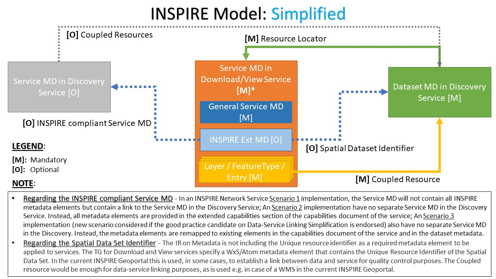
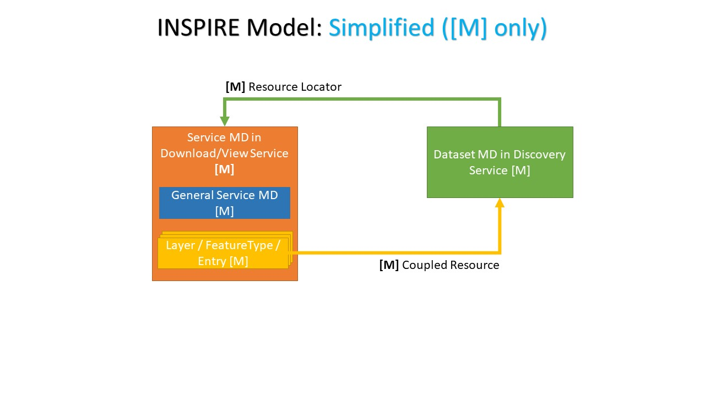
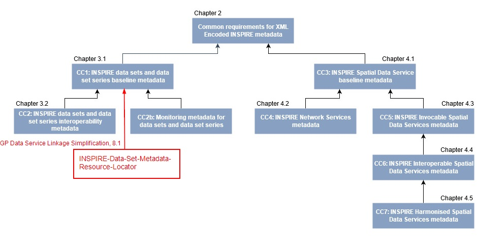
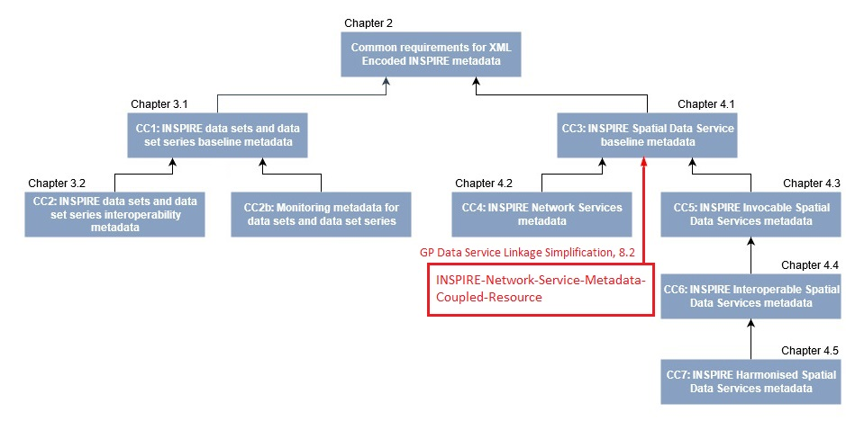

# Data Service Linking Simplification: Good Practice guidelines

`Version: draft 1.0`
`Date: 2021-10-21`

## Table of Contents

_TO_BE_REVIEWED_

* [1. Introduction](#introduction)
* [2. Scope](#scope)
* [3. Conformance](#conformance)
* [4. Normative references](#normative-references)
* [5. Terms and definitions](#terms-and-definitions)
* [6. Acronyms](#acronyms)
* [7. Data Service Linking Simplification](#ds-linking-simplif)
    * [7.1. Main principles](#main-principles)
    * [7.2. Resources](#resources)
* [8. Requirements classes](#rcs)
    * [8.1. INSPIRE Data Set Metadata Resource Locator](#rcs-ds-md-resloc)
        * [8.1.1. Requirements class: “INSPIRE-Data-set-Metadata-Resource-Locator”](#rc-ds-md-resloc)
    * [8.2. INSPIRE Network Service Metadata Coupled Resource](#rcs-ns-md-coupledres)
        * [8.2.1. Requirements class: “INSPIRE-Network-Service-Metadata-Coupled-Resource-Service-Metadata”](#rc-ns-md-coupledres-svr-md)
        * [8.2.2. Requirements class: “INSPIRE-Network-Service-Metadata-Coupled-Resource-View-Service-WMS”](#rc-ns-md-coupledres-view-wms)
        * [8.2.3. Requirements class: “INSPIRE-Network-Service-Metadata-Coupled-Resource-Download-Service-WFS”](#rc-ns-md-coupledres-dwnl-wfs)
        * [8.2.4. Requirements class: “INSPIRE-Network-Service-Metadata-Coupled-Resource-Download-Service-Atom”](#rc-ns-md-coupledres-dwnl-atom)
* [9. Future developments](#future-dev)
* [Annex A: Examples](#annex-a)
* [Annex B: Mapping of INSPIRE elements in ExtendedCapabilities](#annex-b)

## 1. Introduction <a name="introduction"></a>

This good practice candidate is based on the collection and comparison of proposals received from the members of the temporary MIWP technical sub-group 2.3.2 on data and service linking simplification. This document leverages on the recommendations, initially described in the [Discussion Paper on possible simplification of data-service linking in INSPIRE](https://github.com/INSPIRE-MIF/gp-data-service-linking-simplification/blob/main/resources/Discussion%20Paper%20on%20data-service%20linking%20v0.5.docx), and further improved by the subsequent [proposals for the simplification approach](https://github.com/INSPIRE-MIF/gp-data-service-linking-simplification/tree/main/proposals) made by the members of the technical sub-group.

The reference for the metadata specification used in this proposal is the [INSPIRE MD TG]. The reference for the INSPIRE Network Service (Download and View) specifications are the [INSPIRE NS - Download Service TG] and [INSPIRE NS - View Service TG], respectively.

## 2. Scope <a name="scope"></a>

This document provides a set of opinionated interpretations and rules, that de facto standard web applications can currently support, based on the current list of Requirements and Recommendations expressed in the INSPIRE Technical Guidance (TG) documents.

## 3. Conformance <a name="conformance"></a>

The requirements classes expressed here apply to the data set and service metadata records, as well as to the service (capabilities) documents.
In particular, the data set and service metadata records shall be INSPIRE-compliant (verifiable through tests performed in the Reference Validator), should be available in the relevant national geoportal catalog (see https://inspire.ec.europa.eu/INSPIRE-in-your-Country), and consequently harvested by the [INSPIRE Geoportal](https://inspire-geoportal.ec.europa.eu).

Furthermore, at the time of writing, the requirements expressed here for the Download Services are not applicable for specifications based on OGC APIs due to the lack of an agreed mapping for some conditional and mandatory INSPIRE metadata elements (in particular the Coupled Resource, and Unique Resource Identifier) in the [OAPIF GP] document.

## 4. Normative references <a name="normative-references"></a>

- **[ISO 19115:2005]** - EN ISO 19115:2005, *Geographic information — Metadata*
- **[ISO 19119:2016]** - EN ISO 19119:2016, *Geographic information — Services*
- **[ISO/TS 19139:2007]** - ISO/TS 19139:2007, *Geographic information — Metadata — XML schema implementation*
- **[IRs for NS]** - Commission Regulation (EC) No 976/2009 of 19 October 2009 implementing Directive 2007/2/EC of the European Parliament and of the Council as regards the Network Services
- **[IRs for ISDSS]** - Commission Regulation (EU) No 1089/2010 of 23 November 2010 implementing Directive 2007/2/EC of the European Parliament and of the Council as regards interoperability of spatial data sets and services
- **[INSPIRE MD TG]** - JRC. *Technical Guidance for the implementation of INSPIRE dataset and service metadata based on ISO/TS 19139:2007*.  v2.0.1 - 2017-03-02
- **[INSPIRE NS - Download Service TG]** - JRC. *Technical Guidance for the implementation of INSPIRE Download Services*. v3.1 - 2013-08-09
- **[INSPIRE NS - View Service TG]** - JRC. *Technical Guidance for the implementation of INSPIRE View Services*. v3.11 - 2013-04-04
- **[RFC 4287]** - Internet Engineering Task Force (IETF). RFC 4287, *The Atom Syndication Format*. Initial release: December 2005

<!-- Second parts of the reference-style links, see also https://www.markdownguide.org/basic-syntax/#reference-style-links  -->
[ISO 19115:2005]: https://www.isotc211.org/2005/gmd "ISO 19115:2005, Geographic information — Metadata"
[ISO 19119:2016]: https://www.iso.org/standard/59221.html?browse=tc "ISO 19119:2016, Geographic information — Services"
[ISO/TS 19139:2007]: https://www.isotc211.org/2005/gmd/ "ISO/TS 19139:2007, Geographic information — Metadata — XML schema implementation"
[IRs for NS]: https://eur-lex.europa.eu/legal-content/EN/TXT/HTML/?uri=CELEX:02009R0976-20141231&from=EN "Implementing Rules for Network Services (consolidated version of 31/12/2014)"
[IRs for ISDSS]: https://eur-lex.europa.eu/legal-content/EN/TXT/HTML/?uri=CELEX:02010R1089-20141231&from=EN "Implementing Rules for interoperability of spatial data sets and services (consolidated version of 31/12/2014)"
[INSPIRE MD TG]: https://inspire.ec.europa.eu/id/document/tg/metadata-iso19139 "Technical Guidance for the implementation of INSPIRE dataset and service metadata based on ISO/TS 19139:2007"
[INSPIRE NS - Download Service TG]: https://inspire.ec.europa.eu/documents/technical-guidance-implementation-inspire-download-services "Technical Guidance for the implementation of INSPIRE Download Services"
[INSPIRE NS - View Service TG]: https://inspire.ec.europa.eu/documents/technical-guidance-implementation-inspire-view-services-1 "Technical Guidance for the implementation of INSPIRE View Services"
[RFC 4287]: https://www.rfc-editor.org/rfc/rfc4287 "The Atom Syndication Format"

## 5. Terms and definitions <a name="terms-and-definitions"></a>

For the purposes of this document, the following terms and definitions apply:

| Term | Definition | Source |
| --- | --- | --- |
| content negotiation | The practice of providing multiple representations available via the same URI | [ISO/IEC 19788](https://www.iso.org/obp/ui/#iso:std:iso-iec:19788:-7:ed-1:v1:en:sec:3.20) |
| data set | Identifiable collection of data. | [ISO 19115](https://www.iso.org/obp/ui/#iso:std:iso:19115:-2:ed-2:v1:en:sec:3.6) |
| direct access download service | Download Service which provides access to the Spatial Objects in Spatial Data Sets based upon a query | [IRs for NS] |
| encoding | Conversion of data into a series of codes. | [ISO 19118](https://www.iso.org/obp/ui/#iso:std:iso:19118:ed-2:v1:en:term:4.13) |
| encoding rule | Identifiable collection of conversion rules that define the encoding for a particular data structure. | [ISO 19118](https://www.iso.org/obp/ui/#iso:std:iso:19118:ed-2:v1:en:term:4.14) |

**NOTE** ISO and the European Commission maintain comprehensive terminological databases at the following addresses:
- [ISO Online browsing platform](https://www.iso.org/obp)
- [INSPIRE glossary](http://inspire.ec.europa.eu/glossary)

## 6. Acronyms <a name="acronyms"></a>

| Abbreviation | Term |
| --- | --- |
| API | Application Programming Interface |
| GML | Geography Markup Language |
| URL | Uniform Resource Locator |
| WFS | Web Feature Service |
| WMS | Web Map Service |
| WMTS | Web Map Tile Service |

## 7. Data Service Linking Simplification <a name="ds-linking-simplif"></a>

### 7.1. Main principles <a name="main-principles"></a>

- An INSPIRE data set shall have INSPIRE View and Download services.
- The linkage between the data set and the View and Download services shall be ensured by the bidirectional relationship between the data set metadata and the service metadata.

### 7.2. Resources <a name="resources"></a>





## 8. Requirements classes <a name="rcs"></a>

### 8.1. INSPIRE Data Set Metadata Resource Locator” <a name="rcs-ds-md-resloc"></a>

### 8.1.1. Requirements class “INSPIRE-Data-Set-Metadata-Resource-Locator” <a name="rc-ds-md-resloc"></a>

| Requirements class | http://inspire.ec.europa.eu/id/spec/ds-linking-simplification/1.0/ds-md-resource-locator |
| --- | --- |
| Target type | ISO/TS 19139:2007 Geographic information Metadata XML schema implementation (Data sets and Data set series metadata) |
| Dependency | https://inspire.ec.europa.eu/id/ats/metadata/2.0/datasets-and-series (See NOTE below) |

\* NOTE: This is the URI of the Conformance class. Refer to [INSPIRE MD TG] [Chapter 3.1](https://github.com/INSPIRE-MIF/technical-guidelines/blob/2022.2/metadata/metadata-iso19139/metadata-iso19139.adoc#31-baseline-metadata-for-data-sets-and-data-set-series) to look up for information about the requirements class itself.

The following graphic illustrates the dependency of the “INSPIRE-Data-Set-Metadata-Resource-Locator” requirements class from Conformance Class 1 “INSPIRE data sets and data set series baseline metadata” defined in Chapter 3.1 of the [INSPIRE MD TG], which establishes the requirements for metadata records describing an INSPIRE data set or data set series encoded in ISO 19139 based XML format.



The Resource Locator element of a data set metadata record shall point to the URL where the service can be contacted. 

Setting up the correct resource locators is important for the connection between the data sets and the services that provide access to them, or for providing additional information concerning the data sets.

In particular, **TG Requirement 1.8** of [INSPIRE MD TG] expresses the obligation to provide online access, if available, to the described data set or data set series.

Furthermore, the INSPIRE legal framework requires that data sets are made available through View and Download services, which in turn implies that at least two locators need to be expressed in the data set metadata: one for a View Service and one for a Download Service.

The “/req/view-linkage” and “/req/download-linkage” requirements below are an enforcement of **TG Recommendation 1.9** in [INSPIRE MD TG] for the data set metadata record.

The class described in this section requires that the Resource Locator element shall point to the set of additional information about a service resource (i.e. "Get Download/View Service Metadata" operation). 

Additionally, The class described in this section requires the presence of `<gmd:protocol>` and `<gmd:applicationProfile>`, paired with the defined codelist values from the INSPIRE Registry. This would imply fulfilling this portion of the simplification described here.

The presence of additional Resource Locator elements, pointing to the data set itself (e.g. "Get Spatial Data Set" request of a Download Service), is allowed, due to the multiplicity expressed by **TG Requirement 1.8**. Consequently, these additional Resource Locator elements should avoid at least the use of the `<gmd:applicationProfile>` element specified below, in order to reduce the complexity of a machine-to-machine element recognition made by an INSPIRE software implementation such as the INSPIRE Geoportal.

#### Recommendation: \<gmd:protocol\> element

- For this element, the INSPIRE Registry offers a set of external codelist values from the [ProtocolValue codelist](https://inspire.ec.europa.eu/metadata-codelist/ProtocolValue).
- Regarding the label of a codelist, the INSPIRE Registry specifies the text to be used, which should follow the metadata language.
- The [INSPIRE MD TG] already recommends the use of the `gmx:Anchor` element, instead of `gco:CharacterString`, when the provided text is a term or code.
- The use of the element `gco:CharacterString` is allowed for backward compatibility with an existing Resource Locator description that might be already compliant with this simplification approach.

| **Recommendation** | **/rec/resource-locator-protocol** |
| --- | --- |
| A | The `protocol` element SHOULD be encoded as `gmx:Anchor`. The attribute `xlink:href` should point to a valid unique resource identifier of the ProtocolValue codelist. The text value should match the related codelist label, expressed in the metadata language where available. |

##### Example of a View Service locator with `<gmx:Anchor>` encoding
```xml
<gmd:protocol>
    <gmx:Anchor xlink:href="http://www.opengis.net/def/serviceType/ogc/wms">OGC Web Map Service</gmx:Anchor>
</gmd:protocol>
```

##### Example of a View Service locator with `<gco:CharacterString>` encoding
```xml
<gmd:protocol>
    <gco:CharacterString>OGC Web Map Service</gco:CharacterString>
</gmd:protocol>
```

_NOTE_: At the time of writing, the above examples use `eng` as metadata language, and they express the codelist `http://www.opengis.net/def/serviceType/ogc/wms` with the label "OGC Web Map Service". Please, check and use always the codelist label currently in force within the INSPIRE Registry.

#### Recommendation: \<gmd:applicationProfile\> element

- For this element, the INSPIRE Registry provides the values from the [SpatialDataServiceType codelist](https://inspire.ec.europa.eu/metadata-codelist/SpatialDataServiceType).
- Regarding the label of a codelist, the INSPIRE Registry specifies the text to be used, which should follow the metadata language.
- The [INSPIRE MD TG] already recommends the use of the `gmx:Anchor` element, instead of `gco:CharacterString`, when the provided text is a term or code.
- The existence of the element `gco:CharacterString` is allowed for backward compatibility with an existing Resource Locator description that might be already compliant **with this simplification **.


| **Recommendation** | **/rec/resource-locator-application-profile** |
| --- | --- |
| A | The element `applicationProfile` SHOULD be encoded with `gmx:Anchor`. The attribute `xlink:href` should point to a valid unique resource identifier of the mentioned codelist. The text value should match the related codelist label, expressed in the metadata language where available. |

##### Example of a Download Service locator with `<gmx:Anchor>` encoding
```xml
<gmd:applicationProfile>
    <gmx:Anchor xlink:href="https://inspire.ec.europa.eu/metadata-codelist/SpatialDataServiceType/download">Downloaddienst</gmx:Anchor>
</gmd:applicationProfile>
```

##### Example of a Download Service locator with а `<gco:CharacterString>` encoding
```xml
<gmd:applicationProfile>
    <gco:CharacterString>Downloaddienst</gco:CharacterString>
</gmd:applicationProfile>
```

_NOTE_: At the time of writing, the above examples use `dut` as metadata language, and they express the codelist `https://inspire.ec.europa.eu/metadata-codelist/SpatialDataServiceType/download` with the label "Downloaddienst". Please, check and use always the codelist label currently in force within the INSPIRE Registry.

#### Requirement: INSPIRE View Service linking

- Within the element `gmd:URL` linking to a view service, the URL shall point to the response of a "Get View Service Metadata" request of the service providing access to this data set (e.g. the "GetCapabilities" document in the case of an OGC:WMS service).

| Requirement | /req/view-linkage |
|---|---|
| A | A Resource Locator to an INSPIRE View Service providing view access to the described data set or data set series SHALL be given. It SHALL be encoded using the `/gmd:MD_Metadata/gmd:distributionInfo/gmd:MD_Distribution/gmd:transferOptions/gmd:MD_DigitalTransferOptions/gmd:onLine/gmd:CI_OnlineResource` element. |
| B | The element `gmd:URL` SHALL point to the response of the Get View Service Metadata request of the View Service |
| C | The element `gmd:protocol` SHALL be present. |
| D | If the element `gmd:protocol` is encoded using `gmx:Anchor`, the attribute `gmx:Anchor/@xlink:href` SHALL point to the URI of one of the values in https://inspire.ec.europa.eu/metadata-codelist/ProtocolValue. |
| E | If the element `gmd:protocol` is encoded using `gco:CharacterString`, the text value of `gco:CharacterString` SHALL match the label of one of the values in https://inspire.ec.europa.eu/metadata-codelist/ProtocolValue in the language of the metadata language. |
| F | The element `gmd:applicationProfile` SHALL be present. |
| G | If the element `gmd:applicationProfile` is encoded using `gmx:Anchor`, the attribute `gmx:Anchor/@xlink:href` SHALL point to https://inspire.ec.europa.eu/metadata-codelist/SpatialDataServiceType/view. |
| H | If the element `gmd:applicationProfile` is encoded using `gco:CharacterString`, the text value of `gco:CharacterString` SHALL match the label of https://inspire.ec.europa.eu/metadata-codelist/SpatialDataServiceType/view in the language of the metadata language. |

See [Annex A: Examples](#annex-a) for an example of this linkage requirement.


#### Requirement: INSPIRE Download Service linkage

- Within the element `gmd:URL` linking to a download service, the URL shall point to the response of a "Get Download Service Metadata" request of the service providing access to this data set (e.g. the "GetCapabilities" document in the case of an OGC:WFS service).

| Requirement | /req/download-linkage |
|---|---|
| A | A Resource Locator to an INSPIRE Download Service providing download access to the described data set or data set series SHALL be given. It SHALL be encoded using the `/gmd:MD_Metadata/gmd:distributionInfo/gmd:MD_Distribution/gmd:transferOptions/gmd:MD_DigitalTransferOptions/gmd:onLine/gmd:CI_OnlineResource` element. |
| B | The element `gmd:URL` SHALL point to the response of the Get Download Service Metadata request of the Download Service |
| C | The element `gmd:protocol` SHALL be present. |
| D | If the element `gmd:protocol` is encoded using `gmx:Anchor`, the attribute `gmx:Anchor/@xlink:href` SHALL point to the URI of one of the values in https://inspire.ec.europa.eu/metadata-codelist/ProtocolValue. |
| E | If the element `gmd:protocol` is encoded using `gco:CharacterString`, the text value of `gco:CharacterString` SHALL match the label of one of the values in https://inspire.ec.europa.eu/metadata-codelist/ProtocolValue in the language of the metadata language. |
| F | The element `gmd:applicationProfile` SHALL be present. |
| G | If the element `gmd:applicationProfile` is encoded using `gmx:Anchor`, the attribute `gmx:Anchor/@xlink:href` SHALL point to https://inspire.ec.europa.eu/metadata-codelist/SpatialDataServiceType/download. |
| H | If the element `gmd:applicationProfile` is encoded using `gco:CharacterString`, the text value of `gco:CharacterString` SHALL match the label of https://inspire.ec.europa.eu/metadata-codelist/SpatialDataServiceType/download in the language of the metadata language. |

See [Annex A: Examples](#annex-a) for an example of this linkage requirement.

### 8.2. INSPIRE Network Service Metadata Coupled Resource  <a name="#rcs-ns-md-coupledres"></a>

The Coupled Resource metadata element refers to, where relevant, the target spatial data set(s) of the described service.  
It is implemented through a URL that points to the metadata record of the data set on which the service operates. Therefore, it helps to link services to the relevant data sets.

Regarding the definition of a Network Service metadata, two scenarios have been identified for publishing metadata conforming to the [IRs for NS], and on the [INSPIRE MD TG]. It is up to the Member State to choose which scenario best fits their specific needs. As these scenarios are not mutually exclusive, a Member State may also choose to implement both.

-- TO BE REVISED --
**NOTE** For the ATOM implementation, the [INSPIRE NS - Download Service TG] does not offer a similar multiple scenario configuration due to the lack of mapping elements in such an implementation.
-- END --

#### 8.2.1. Requirements class “INSPIRE-Network-Service-Metadata-Coupled-Resource-Service-Metadata”  <a name="rc-ns-md-coupledres-svr-md"></a>

#### INSPIRE Network service - Scenario 1

- In Scenario 1, the INSPIRE network service metadata is available in a Discovery Service catalog and is referenced through the `<inspire_common:MetadataURL>` element within the INSPIRE ExtendedCapabilities section of such service.
- The service metadata shall define a `<srv:operatesOn>` element for every defined data set published by the service.
- The data set metadata URL may point to a Discovery Service different from the national reference catalog. This may apply especially for federated Discovery Service catalogues.

In this scenario, the Coupled Resource metadata element is implemented by reference, i.e. through a URL that points to the metadata record of the data set on which the service operates.

#### Requirements class

This requirements class applies when INSPIRE Network service - Scenario 1 is used.

| Requirements class | http://inspire.ec.europa.eu/id/spec/ds-linking-simplification/1.0/ns-md-coupled-resource-svr-md |
| --- | --- |
| Target type | ISO/TS 19139:2007 Geographic information Metadata XML schema implementation (Data set metadata) |
| Dependencies | https://inspire.ec.europa.eu/id/ats/metadata/2.0/datasets-and-series (See NOTE below) |

\* NOTE: This is the URI of the Conformance class. Refer to [INSPIRE MD TG] [Chapter 4.1](https://github.com/INSPIRE-MIF/technical-guidelines/blob/2022.2/metadata/metadata-iso19139/metadata-iso19139.adoc#41-baseline-metadata-for-spatial-data-services) to look up for information about the requirements class itself.

The following graphic illustrates the dependency of the “INSPIRE-Network-Service-Metadata-Coupled-Resource” requirements class from Conformance Class 3 “INSPIRE Spatial Data Service baseline metadata” defined in Chapter 4.1 of the [INSPIRE MD TG], which establishes the requirements for metadata records describing INSPIRE spatial data services encoded in ISO 19139 based XML format.



#### Recommendation: \<srv:operatesOn\> element

According **TG Requirement 3.6** of [INSPIRE MD TG], the links pointing to the online metadata descriptions of data sets provided by the described service shall be given using `<srv:operatesOn>` element. The multiplicity of this element is 0..n.

Futhermore, this property shall be implemented by reference. The `xlink:href` attribute of each of the `<srv:operatesOn>` elements shall contain a URI pointing to the `<gmd:MD_DataIdentification>` element of the metadata record of the provided the data set or data set series.

This specification proposes to relax the implementation of the Coupled Resource by making the linkage to the `<gmd:MD_DataIdentification>` element of the data set metadata an optional feature, just pointing to the URL of the metadata, with or without the additional `#MD_DataIdentification` pointer).

##### Rationale
Although [ISO 19119:2016] requires that the target of the `<srv:operatesOn>` element (Coupled Resource) is the `#MD_DataIdentification` class of the linked dataset metadata, due to the different existing metadata implementations, this specification proposes to allow a more simple implementation of the Coupled Resource linkage, as stated above. 

##### Changes to the current INSPIRE framework

In [Section 4.1.2.4](https://github.com/INSPIRE-MIF/technical-guidelines/blob/2022.1/metadata/metadata-iso19139/metadata-iso19139.adoc#4124-linking-to-provided-data-sets-using-coupled-resource) of the [INSPIRE MD TG]:

**1**. Replace TG Requirement 3.6:

> TG Requirement 3.6: metadata/2.0/req/sds/coupled-resource
> 
> Links pointing to the online metadata descriptions of data sets provided by the described service shall be given using _srv:operatesOn_ element.
> 
> The multiplicity of this element is 0..n.
> 
> This property shall be implemented by reference. The `xlink:href` attribute of each of the `<srv:operatesOn>` elements shall contain a URI pointing to the _gmd:MD_DataIdentification_ element of the metadata record of the provided the data set or data set series.

with this content:

> TG Requirement 3.6: metadata/2.0/req/sds/coupled-resource
> 
> Links pointing to the online metadata descriptions of data sets provided by the described service shall be given using `<srv:operatesOn>` element.
> 
> The multiplicity of this element is 0..n.
> 
> This property shall be implemented by reference. The `xlink:href` attribute of each of the `<srv:operatesOn>` elements shall contain a URI pointing to the metadata record of the provided data set or data set series.

**2**. Add the following TG Recommendation, and subsequent Explanatory note and Example, just after the amended TG Requirement 3.6:

TG Recommendation:

> TG Recommendation _X.Y_:
> In order to be fully compliant with [ISO 19119:2016], the URI contained in the `xlink:href` attribute of each of the `<srv:operatesOn>` elements should specifically point to the `<gmd:MD_DataIdentification>` element of the metadata record of the provided data set or data set series.

Explanatory note:

> NOTE: The different practices in the implementation of the Coupled Resource element in existing metadata is acknowledged. Despite [ISO 19119:2016] requires that the target of the `<srv:operatesOn>` elements (Coupled Resource) is the `#MD_DataIdentification` class of the linked dataset metadata, this technical guidelines allows a more simple approach for the service-data set linking by allowing, in the `xlink:href` attribute of each of the `<srv:operatesOn>` elements, the use of URI values with or without the `#MD_DataIdentification` pointer.

Example:

> `/gmd:MD_Metadata/gmd:identificationInfo/srv:SV_ServiceIdentification/srv:operatesOn`:
> 
> `<srv:operateson xlink:href="http://example.com/csw?SERVICE=CSW&amp;VERSION=2.0.2&amp;REQUEST=GetRecordById&amp;ID=f9ee6623-cf4c-11e1-9105-0017085a97ab&amp;OUTPUTSCHEMA=http://www.isotc211.org/2005/gmd&amp;ELEMENTSETNAME=full">
> </srv:operateson>`
> 
> Example _X.Y_: Pattern for the Coupled resource link given using the `<srv:operatesOn>` element with URL pointing to the metadata record of the provided data set or data set series, without any fragment identifier specifically pointing to the `<gmd:MD_DataIdentification>` element.
> 
> `<srv:operateson xlink:href="https://geometadaten.lfrz.at/at.lfrz.discoveryservices/srv/ger/csw?SERVICE=CSW&amp;VERSION=2.0.2&amp;REQUEST=GetRecordById&amp;ID=9db8a0c3-e92a-4df4-9d55-8210e326a7ed&amp;OUTPUTSCHEMA=http://www.isotc211.org/2005/gmd&amp;ELEMENTSETNAME=full">
> </srv:operateson>`
> 
> Example _X.Y_: Working example from the Austrian national SDI based on the previous pattern - Linked URL: https://geometadaten.lfrz.at/at.lfrz.discoveryservices/srv/ger/csw?SERVICE=CSW&VERSION=2.0.2&REQUEST=GetRecordById&ID=9db8a0c3-e92a-4df4-9d55-8210e326a7ed&OUTPUTSCHEMA=http://www.isotc211.org/2005/gmd&ELEMENTSETNAME=full. 

#### Recommendation: \<srv:operatesOn\> element priority over \<wms:MetadataURL\> and \<wfs:MetadataURL\> elements

| **Recommendation** | **/rec/coupled-resource-operateson-match-metadataurl** |
| --- | --- |
| A | Within the Scenario 1 implementation, the references described with these optional `metadataURL` elements should match each of the `srv:operatesOn` elements contained in the service metadata record. In case of discrepancies, the references expressed with `srv:operatesOn` prevail over the other associations. |


#### 8.2.2. Requirements class “INSPIRE-Network-Service-Metadata-Coupled-Resource-View-Service-WMS”  <a name="rc-ns-md-coupledres-view-wms"></a>

#### INSPIRE Network service - Scenario 2

- In Scenario 2, the [INSPIRE NS - View Service TG] maps all INSPIRE metadata elements to the applicable elements in the service, e.g. OGC WMS Capabilities in this case. For OGC WMS services, it currently relies on the ExtendedCapabilities section for the remaining elements. [Annex B](#annex-b), which is subject to future work proposes an approach for the revision of the mapping of the INSPIRE requirements with the aim to possibly remove the Extended Capabilities section.
- The data set metadata URL may point to a Discovery Service different from the national reference catalog. This may apply especially for federated Discovery Service catalogues.

#### Requirements class

This requirements class applies when INSPIRE Network service - Scenario 2 is used for Web Map Services.

| Requirements class | http://inspire.ec.europa.eu/id/spec/ds-linking-simplification/1.0/ns-md-coupled-resource-view-wms |
| --- | --- |
| Target type | ISO 19128:2005 - Geographic information — Web map server interface (OGC WMS View service) |
| Dependency | https://inspire.ec.europa.eu/id/ats/view-service (see NOTE below) |

\* NOTE: This is the URI of the Conformance class. Refer to [INSPIRE NS - View Service TG] Chapter 4 "INSPIRE Profile of ISO 19128" to look up for information about the requirements class itself.

### Requirements: \<wms:MetadataURL\> element

According **TG Requirement 13** of [INSPIRE NS - View Service TG], the Coupled Resource metadata element shall be mapped to the `<wms:MetadataURL>` elements of the Layer elements of the service capabilities. If linkage to the data sets or series on which the service operates are available, then the linkage to these resources shall be provided as stated by the [INSPIRE MD TG].

Aditionally, according **TG Requirement 14** of [INSPIRE NS - View Service TG], each of the `<wms:MetadataURL>` elements shall be populated with a URL that allows access to an unambiguous metadata record. The URL shall be either an HTTP/GET call on the `GetRecordById` operation of the Discovery Service or a direct link to the ISO 19139 data set or data set series metadata document.


#### 8.2.3. Requirements class “INSPIRE-Network-Service-Metadata-Coupled-Resource-Download-Service-WFS”  <a name="rc-ns-md-coupledres-dwnl-wfs"></a>

#### INSPIRE Network service - Scenario 2

 - In Scenario 2, the [INSPIRE NS - Download Service TG] maps all INSPIRE metadata elements to the applicable elements in the service, e.g. WFS OGC Capabilities in this case. For OGC WFS services, it currently relies on the ExtendedCapabilities section for the remaining elements. [Annex B](#annex-b), which is subject to future work proposes an approach for the revision of the mapping of the INSPIRE requirements with the aim to possibly remove the Extended Capabilities section.
- The data set metadata URL may point to a Discovery Service different from the national reference catalog. This may apply especially for federated Discovery Service catalogues.

#### Requirements class

This requirements class applies when INSPIRE Network service - Scenario 2 is used for Web Feature Services.

| Requirements class | http://inspire.ec.europa.eu/id/spec/ds-linking-simplification/1.0/ns-md-coupled-resource-dwnl-wfs |
| --- | --- |
| Target type | ISO 19142:2010 - Geographic information — Web Feature Service (OGC WFS Download service) |
| Dependency | --- |

### Requirement: \<wfs:MetadataURL\> element

Section 6.6 of [INSPIRE NS - Download Service TG], in Chapter 6 "Web Feature Service and Filter Encoding Implementation of Pre-defined Dataset Download Service", defines two options to make the Download Service INSPIRE metadata elements available in a standard Web Feature Service (WFS).

The first option is to use the `ows:ExtendedCapabilities` to publish a link to a Download Service metadata record. (e.g. in a discovery service). This should be done using a `<inspire_common:MetadataURL>` in the extended capabilities section of the INSPIRE WFS service. 
The second option is to publish all the metadata elements directly in the `<WFS_Capabilities>` (and `ows:ExtendedCapabilities`) using a predefined mapping specified in this section.

The mapping described for the second option, sets the mapping of the Coupled Resource metadata element to the `wfs:MetadataURL` element of an ISO 19142 `<WFS_Capabilities>` Web Feature Service.

This specification reinforces the use of this second option with the requirements class defined below.

| **Requirement** | **/req/coupled-resource-metadataurl-locator** |
| --- | --- |
| A | The URL expressed within the `wfs:MetadataURL` element SHALL point to the metadata record of the provided data set or data set series, available in a Discovery Service catalog. |


#### 8.2.4. Requirements class “INSPIRE-Network-Service-Metadata-Coupled-Resource-Download-Service-Atom”  <a name="rc-ns-md-coupledres-dwnl-atom"></a>

#### INSPIRE Network service - Scenario 2

 - In Scenario 2, the [INSPIRE NS - Download Service TG] maps all INSPIRE metadata elements to the applicable elements in the service, e.g. ATOM feed elements in this case. [Annex B](#annex-b), which is subject to future work proposes an approach for the revision of the mapping of the INSPIRE requirements with the aim to possibly remove the Extended Capabilities section.
- The data set metadata URL may point to a Discovery Service different from the national reference catalog. This may apply especially for federated Discovery Service catalogues.

#### Requirements class

This requirements class applies when INSPIRE Network service - Scenario 2 is used for Atom download services.

| Requirements class | http://inspire.ec.europa.eu/id/spec/ds-linking-simplification/1.0/ns-md-coupled-resource-dwnl-atom |
| --- | --- |
| Target type | Atom Syndication Format (Atom download service) |
| Dependency | https://inspire.ec.europa.eu/id/ats/download-atom (see NOTE below) |

\* NOTE: This is the URI of the Conformance class. Refer to [INSPIRE NS - Download Service TG] Chapter 5 "Atom Implementation of Pre-defined Dataset Download Service" to look up for information about the requirements class itself.

### Requirement: Download Service Feed \<entry\> element

According **TG Requirement 14** of [INSPIRE NS - Download Service TG], each feed `<entry>` in a 'Download Service Feed' shall contain a link to a data set metadata record. This link shall have a `rel` attribute with a value of `describedby` and a `type` attribute with a value `application/xml`.


## 9. Future developments <a name="future-dev"></a>

Further simplifications may be possible on a broader level about the INSPIRE implementation.

Note that often the organisation responsible for the metadata is not the same as the organisation responsible for the service operations. In "_Scenario 1_", this situation could easily lead to duplications, errors and/or lack of synchronised information. Such issues could be avoided by implementing "_Scenario 2_", whose requirements and definitions are already provided in both the [INSPIRE NS - Download Service TG] and [INSPIRE NS - View Service TG] documents. In this case, the service metadata would be no longer required (at least for the purpose of this linkage simplification), so its creation could be skipped or automated by dedicated software implementations of the INSPIRE Discovery Service.

Furthermore, the implementation of "_Scenario 2_" for Network Services could provide an opportunity for the revision of the mapping of the INSPIRE requirements, currently expressed in the Extended Capabilities section (especially the Conformance declaration) requiring the use of specialised extensions of software products. Refer to the [Annex B](#annex-b) for further details.


# Annex A: Examples <a name="annex-a"></a>

## Examples (XML encoded)
The following collection shows a series of XML snippets.
_These examples are purely informative and do not constitute a reference definition of a conformant metadata._

### Examples of Resource Locator for INSPIRE View Service

#### Resource Locator to a "Get View Service Metadata" operation - WMS GetCapabilities

```xml
<gmd:transferOptions>
  <gmd:MD_DigitalTransferOptions>
      [...]
    <gmd:onLine>
      <gmd:CI_OnlineResource>
        <gmd:linkage>
          <gmd:URL>http://.../wms?request=GetCapabilities&amp;service=WMS&amp;version=1.3.0</gmd:URL>
        </gmd:linkage>
        <gmd:protocol>
          <gmx:Anchor xlink:href="http://www.opengis.net/def/serviceType/ogc/wms">OGC Web Map Service</gmx:Anchor>
        </gmd:protocol>
        <gmd:applicationProfile>
          <gmx:Anchor xlink:href="http://inspire.ec.europa.eu/metadata-codelist/SpatialDataServiceType/view">View Service</gmx:Anchor>
        </gmd:applicationProfile>
        <gmd:name>
          <gco:CharacterString>INSPIRE WMS</gco:CharacterString>
        </gmd:name>
      </gmd:CI_OnlineResource>
    </gmd:onLine>
      [...]
  </gmd:MD_DigitalTransferOptions>
</gmd:transferOptions>
```

#### Additional Resource Locator to an "View Service - Get Map" operation - WMS GetMap

```xml
<gmd:transferOptions>
  <gmd:MD_DigitalTransferOptions>
      [...]
    <gmd:onLine>
      <gmd:CI_OnlineResource>
        <gmd:linkage>
          <gmd:URL>http://.../wms?request=GetMap&amp;service=WMS&amp;version=1.3.0&amp;layers=1&amp;styles=default&amp;CRS=EPSG:4258&amp;format=image/png&amp;bbox=0.87,43.26,11.68,48.13&amp;width=600&amp;height=400</gmd:URL>
        </gmd:linkage>
        <gmd:protocol>
          <gmx:Anchor xlink:href="http://www.opengis.net/def/serviceType/ogc/wms">OGC Web Map Service</gmx:Anchor>
        </gmd:protocol>
        <gmd:name>
          <gco:CharacterString>INSPIRE WMS - GetMap request</gco:CharacterString>
        </gmd:name>
      </gmd:CI_OnlineResource>
    </gmd:onLine>
      [...]
  </gmd:MD_DigitalTransferOptions>
</gmd:transferOptions>
```

### Examples of Resource Locator for INSPIRE Download Service

#### Resource Locator to a "Get Download Service Metadata" operation - ATOM topfeed

```xml
<gmd:transferOptions>
  <gmd:MD_DigitalTransferOptions>
      [...]
    <gmd:onLine>
      <gmd:CI_OnlineResource>
        <gmd:linkage>
          <gmd:URL>http://.../atom/INSPIRE_DW_dataset_2021</gmd:URL>
        </gmd:linkage>
        <gmd:protocol>
          <gmx:Anchor xlink:href="https://tools.ietf.org/html/rfc4287">ATOM Syndication Format</gmx:Anchor>
        </gmd:protocol>
        <gmd:applicationProfile>
          <gmx:Anchor xlink:href="http://inspire.ec.europa.eu/metadata-codelist/SpatialDataServiceType/download">Download Service</gmx:Anchor>
        </gmd:applicationProfile>
        <gmd:name>
          <gco:CharacterString>INSPIRE Download Service (ATOM)</gco:CharacterString>
        </gmd:name>
      </gmd:CI_OnlineResource>
    </gmd:onLine>
      [...]
  </gmd:MD_DigitalTransferOptions>
</gmd:transferOptions>
```

#### Additional Resource Locator for a "Get Spatial Data Set" - ATOM subfeed

```xml
<gmd:transferOptions>
  <gmd:MD_DigitalTransferOptions>
      [...]
    <gmd:onLine>
      <gmd:CI_OnlineResource>
        <gmd:linkage>
          <gmd:URL>http://.../atom/INSPIRE_DW_2021_Dataset.gml</gmd:URL>
        </gmd:linkage>
        <gmd:protocol>
          <gmx:Anchor xlink:href="https://tools.ietf.org/html/rfc4287">ATOM Syndication Format</gmx:Anchor>
        </gmd:protocol>
        <gmd:name>
          <gco:CharacterString>INSPIRE Download Service (ATOM)</gco:CharacterString>
        </gmd:name>
      </gmd:CI_OnlineResource>
    </gmd:onLine>
      [...]
  </gmd:MD_DigitalTransferOptions>
</gmd:transferOptions>
```

#### Resource Locator to a "Get Download Service Metadata" operation - WFS GetCapabilities

```xml
<gmd:transferOptions>
  <gmd:MD_DigitalTransferOptions>
      [...]
    <gmd:onLine>
      <gmd:CI_OnlineResource>
        <gmd:linkage>
          <gmd:URL>http://.../wfs?service=wfs&amp;version=2.0.0&amp;request=GetCapabilities</gmd:URL>
        </gmd:linkage>
        <gmd:protocol>
          <gmx:Anchor xlink:href="http://www.opengis.net/def/serviceType/ogc/wfs">OGC Web Feature Service</gmx:Anchor>
        </gmd:protocol>
        <gmd:applicationProfile>
          <gmx:Anchor xlink:href="http://inspire.ec.europa.eu/metadata-codelist/SpatialDataServiceType/download">Download Service</gmx:Anchor>
        </gmd:applicationProfile>
        <gmd:name>
          <gco:CharacterString>INSPIRE Download Service (WFS)</gco:CharacterString>
        </gmd:name>
      </gmd:CI_OnlineResource>
    </gmd:onLine>
      [...]
  </gmd:MD_DigitalTransferOptions>
</gmd:transferOptions>
```

#### Additional Resource Locator to a "Download Service - Get Spatial Data Set" operation - WFS Get Feature

_Note: this example covers the WFS definition. For a WCS/SOS service, use the proper codelist for the `protocol` element_

```xml
<gmd:transferOptions>
  <gmd:MD_DigitalTransferOptions>
      [...]
    <gmd:onLine>
      <gmd:CI_OnlineResource>
        <gmd:linkage>
          <gmd:URL>http://.../wfs?service=wfs&amp;version=2.0.0&amp;request=GetFeature&amp;storedquery_id=http://inspire.ec.europa.eu/operation/download/GetSpatialDataSet&amp;DataSetIdCode=mycode&amp;DataSetIdNamespace=mynamespace&amp;CRS=EPSG:4326&amp;Language=eng</gmd:URL>
        </gmd:linkage>
        <gmd:protocol>
          <gmx:Anchor xlink:href="http://www.opengis.net/def/serviceType/ogc/wfs">OGC Web Feature Service</gmx:Anchor>
        </gmd:protocol>
        <gmd:name>
          <gco:CharacterString>WFS GetFeature request to an INSPIRE pre-defined dataset</gco:CharacterString>
        </gmd:name>
      </gmd:CI_OnlineResource>
    </gmd:onLine>
      [...]
  </gmd:MD_DigitalTransferOptions>
</gmd:transferOptions>
```
# Annex B: Mapping of INSPIRE elements in the Extended Capabilities section <a name="annex-b"></a>

The [Discussion Paper on possible simplification of data-service linking in INSPIRE](https://github.com/INSPIRE-MIF/gp-data-service-linking-simplification/blob/main/resources/Discussion%20Paper%20on%20data-service%20linking%20v0.5.docx) proposes a new mapping of the INSPIRE elements contained in the service metadata, as described in the Scenario 2 in the INSPIRE Network Service TGs, in order to remove the need for the Extended Capabilities section and thus achieve an implementation simplification.

Within the MIWP 2.3.2 action, this opportunity (subject to agreement by the sub-group) was further explored by reallocating elements from the Extended Capabilities section to the service metadata. The following tables expresses this proposed reallocation:

| Extended capabilities | Proposed action on mapping | Rationale | Applicable on Service type |
| :- | :- | :- | :- |
| inspire\_common:ResourceType          | Discard | By default = service                                     | WMS - WFS |
| inspire\_common:ResourceLocator       | Discard | Resource locator in the data set metadata                | WMS - WFS |
| inspire\_common:SpatialDataServiceType| Discard | Moved to the applicationProfile in the data set metadata | WMS - WFS |
| inspire\_common:TemporalReference     | TBD | Consider the temporalReference in the data set metadata?     | WMS - WFS |
| inspire\_common:Conformity            | Keep | Declared through the wms:keyword element                    | WMS - WFS |
| inspire\_common:MetadataPointOfContact| TBD | Consider the metadataPointOfContact in the data set metadata | WMS - WFS |
| inspire\_common:MetadataDate          | TBD | Consider the metadataDate in the data set metadata           | WMS - WFS |
| inspire\_common:SupportedLanguages    | TBD | Consider the metadataLanguage in the data set metadata       | WMS - WFS |
| inspire_dls:SpatialDataSetIdentifier/inspire_common:Code <br/> inspire_dls:SpatialDataSetIdentifier/inspire_common:Namespace | Keep | Data set identifier in the data set metadata | WFS |
